# Design Document — Cashier Staffing Planner

> Status: Draft v0.7.0 (design-first). Requirements derived in `requirements.md`; each property links to the requirements it validates. Tasks derived after review.
> Clickable wireframes: `wireframes/index.html` (open in a browser).

## Overview

A production rebuild of the SM Retail cashier staffing prototype (v3). The prototype is a single-page calculator plus a printable leadership summary. The rebuild keeps every prototype capability and wraps it in a multi-user application.

**Pipeline (unchanged from v3):** hourly demand forecast → Erlang C lanes for a service target → shrinkage → shift builder → named weekly roster under PH labor rules → network seasonal hiring plan → leadership summary.

**What changes from the prototype**

| Prototype v3 | Rebuild |
|---|---|
| One page; a global Inputs panel shared by 4 tabs | Separate screens per view; inputs belong to a **scenario** and are edited in a settings drawer |
| Settings are lost on reload | Scenarios are saved, versioned, compared, submitted and approved (HR headcount + Finance budget → Executive plan) |
| Anyone sees everything | Passkey sign-in via Amazon Cognito (smretail.com, 1cloudhub.com only), 8 roles, data scoped by region, store or self; demo role switcher |
| Hiring plan runs in the browser (seconds for 24 departments) | Runs as a background job with progress, stale detection and notifications (208 stores) |
| Holidays, wage and multipliers are hard-coded | Versioned rule sets with effective dates, owned by a Rules Steward |
| Sample data embedded in the page | Data ingestion (POS, master data, staff availability) with validation history |
| Rosters shown as tables and bar grids | Visual planning: Day timeline (drag, resize, activities, staffing-vs-need strip), Week grid (colour-coded shift chips, department filters, totals), Month coverage |
| No sharing of cashiers across departments or stores | Cross-store sharing: Metro Manila network map that matches open shifts to available cashiers by travel time from their home area, and surplus stores to short stores |
| CSV export only | CSV per view plus a PDF/print leadership report generated from a scenario |

**Out of scope for this design:** tech stack and hosting choices, visual brand (tracked as an open question). The wireframes are deliberately grayscale.

## Architecture

### Information architecture

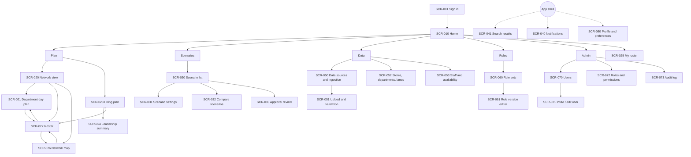

### App shell (every signed-in screen)

```
┌──────────────────────────────────────────────────────────────────────────────┐
│ [≡] SM Cashier Planner  [ Search… ⌘K ]  Viewing as [Planner ▾]  🔔3  (JD▾)     │
├───────────────┬──────────────────────────────────────────────────────────────┤
│ Home          │ Home › Plan › Network view                                   │
│ PLAN          │ ┌ ⚠ Sample data — figures are simulated, not SM actuals ──┐ │
│  Network view │ └──────────────────────────────────────────────────────────┘ │
│  Department   │ [Context bar: Scenario ▾ | Region ▾ | Format ▾ | Store ▾ …]  │
│  Weekly roster│                                                              │
│  Hiring plan  │                     page content                              │
│  Summary      │                                                              │
│ Scenarios     │                                                              │
│ DATA · RULES  │                                                              │
│ ADMIN         │                                                              │
└───────────────┴──────────────────────────────────────────────────────────────┘
```

- **Top bar:** product name, global search (`/` or ⌘K), **role switcher** (demo mode, see Cross-cutting patterns), notifications bell with an unread count, user menu (profile, passkeys, preferences, sign out).
- **Left nav:** items are hidden when the role has no access (never shown disabled).
- **Breadcrumb** and page title.
- **Sample-data banner:** shown on every page while any active dataset is flagged synthetic. It cannot be dismissed.
- **Context bar** (planning screens only): scenario selector with a status pill, then the scope filters. See the Search and filter pattern.
- **Responsive:** laptop keeps the nav expanded; tablet collapses it to icons; mobile moves it into a ≡ drawer, and search becomes an icon that opens full-screen.

### Breakpoints

| Name | Width | Layout |
|---|---|---|
| Mobile | < 600 px | Single column; nav in a drawer; KPI cards 2 per row; wide tables scroll horizontally with a sticky first column; settings drawer is full-screen |
| Tablet | 600–1023 px | Icon nav rail; KPIs 3 per row; charts full width |
| Laptop | 1024–1439 px | Expanded nav; KPIs 4–6 per row; settings drawer overlays content |
| Desktop | ≥ 1440 px | Content max width 1600 px; settings drawer can dock beside content |

Roster grids (cashier × hour, cashier × day) are dense. On mobile they switch to a list: one card per cashier showing their shift, or one card per day.

**Mobile interaction policy (< 600 px).** Every screen works on a phone. Most are read-only there; only approvals and quick actions stay editable.

| Allowed on mobile | Read-only on mobile (shows "Edit on a larger screen") |
|---|---|
| Sign in with a passkey; switch role | Scenario settings, create/duplicate scenarios, run plans |
| Approve / reject / request changes (headcount, budget, plan), with a comment | Rule version editing and publishing |
| Record headcount/budget as secured outside the system | Data upload and master-data editing |
| Store manager: mark a cashier as an emergency off and pick a replacement from the eligible list | Full shift editing (change times, add or remove shifts) |
| Mark notifications read; change notification preferences | User management |
| Staff: view own roster; add to calendar | Staff and availability editing (except emergency off) |
| Export / share links | |

Read-only screens keep all filters, sorting, search and drill-down.

## Components and Interfaces

### Roles and data scope

| Code | Role | Primary job | Default scope |
|---|---|---|---|
| ADM | System Admin | Users, roles, audit, platform settings | Global (no planning data by default) |
| EXE | Executive / Leadership | Reviews the network plan and summary; approves the plan once headcount and budget are secured | Global |
| PLN | Network / Regional Planner | Builds scenarios, runs plans, investigates capacity, submits for approval | Assigned region(s), or global |
| STM | Store Manager | Own store's department plans; **manages the weekly roster directly** (emergency offs, shift changes, cover) | Assigned store(s) |
| HR | HR / Recruitment | **Approves headcount**; hiring timeline; staff roster and availability; exports hires | Global or region |
| FIN | Finance | **Approves the budget**; cost views; reviews wage and pay rules | Global |
| RST | Data / Rules Steward | Data ingestion, master data, versioned business rules | Global |
| STF | Staff (cashier) | Views **their own** published roster and shift changes | Self (own staff record only) |

A user can hold more than one role; permissions combine. A Staff user is linked to one staff record by work email (Q16). In demo mode, a user switching to Staff is shown a seeded demo cashier instead (see Demo data). Scope limits which stores' rows, KPIs and exports a user sees, applied the same way in every view, search result and export.

### RBAC matrix

V = view, E = edit, A = approve/publish, X = export, M = manage (create/edit/delete), — = no access. Scope applies to every cell.

| Capability | ADM | EXE | PLN | STM | HR | FIN | RST | STF |
|---|---|---|---|---|---|---|---|---|
| Home dashboard | V | V | V | V | V | V | V | V (own shifts) |
| Network view (SCR-020) | — | V X | V X | V (own store) | V X | V X | V | — |
| Department day plan (SCR-021) | — | V | V X | V X | V | V | V | — |
| Weekly roster (SCR-022) | — | V | V E X | V M X | V X | V | — | — |
| Edit shifts: times, add/remove, reassign, emergency off | — | — | E (draft scenarios) | M (published roster, own store) | — | — | — | — |
| Staff availability | — | — | E | E | M | — | — | — |
| My roster (SCR-025) | — | — | — | — | — | — | — | V |
| Network map (SCR-026) | — | V | V | V (own store's gaps; candidates from all stores, pseudonymised) | V | — | — | — |
| Send open-shift offers / request staff from another store | — | — | E | E (for own store) | — | — | — | — |
| Approve lending own staff to another store | — | — | E | E (own store) | — | — | — | — |
| Accept / decline shift offers | — | — | — | — | — | — | — | E |
| Raise time-off / swap request | — | — | — | — | — | — | — | E (own) |
| Approve staff time-off / swap request | — | — | — | M (own store) | — | — | — | — |
| Share home area and travel limit (consent) | — | — | — | — | — | — | — | E (own) |
| Hiring plan (SCR-023) | — | V X | V E X | V (own store) | V X | V X | — | — |
| Leadership summary (SCR-024) | — | V X | V X | — | V X | V X | — | — |
| Scenarios: create / duplicate / edit settings | — | — | M | — | — | — | — | — |
| Scenarios: view / compare | — | V | V | V (published only) | V | V | V | — |
| Submit scenario for approval | — | — | E | — | — | — | — | — |
| Approve headcount | — | V | — | — | A | V | — | — |
| Approve budget | — | V | — | — | V | A | — | — |
| Record headcount/budget secured outside the system | — | E | — | — | — | — | — | — |
| Approve / reject / publish plan | — | A | — | — | V | V | — | — |
| Cost figures (₱) | — | V | V | V | V | V | — | — |
| Data ingestion and upload (SCR-050/051) | V | — | V | — | — | — | M | — |
| Stores / departments / lanes (SCR-052) | — | V | V | V (own) | V | — | M | — |
| Staff records (SCR-053) | — | — | V | V E (own store) | M | — | V | — |
| Business rules: edit / submit | — | V | V | — | V | V | M | — |
| Business rules: approve cost rules | — | — | — | — | — | A | — | — |
| Business rules: publish non-cost rules | — | — | — | — | — | — | A | — |
| Users and roles (SCR-070–072) | M | — | — | — | — | — | — | — |
| Audit log (SCR-073) | V X | — | — | — | — | — | V (data/rules events) | — |
| Own profile, passkeys, language, notification preferences | E | E | E | E | E | E | E | E |

**Demo mode:** every signed-in user can switch to any of the 8 roles (see Cross-cutting patterns › Role switcher). The matrix still defines what each role can do while it is active, and the server enforces it for the active role.

### Screen inventory

| ID | Screen | Roles | Purpose | Source |
|---|---|---|---|---|
| SCR-001 | Sign in | All | Passkey sign-in (Cognito); email-domain check; session-expired, domain-not-allowed and passkey-error states | NEW |
| SCR-002 | First sign-in | All | Verify email by one-time code, create a passkey, choose a starting role (demo) and notification choices | NEW |
| SCR-010 | Home | All (role variants) | Role-based dashboard: tasks, alerts, headline KPIs | NEW |
| SCR-020 | Network view | EXE PLN STM HR FIN RST | All stores and departments for a date | v3 tab "All stores & departments" |
| SCR-021 | Department day plan | EXE PLN STM HR FIN RST | One department for one day: hourly plan and shift builder | v3 tab "Single department" |
 EXE PLN STM HR FIN | Named roster with Day timeline, Week grid and Month views; labor-rule checks; store managers edit shifts directly | v3 tab "Weekly roster" + NEW visual editing |
| SCR-023 | Hiring plan | EXE PLN STM HR FIN | Seasonal hires, timeline and store/department table | v3 tab "Hiring plan" |
| SCR-024 | Leadership summary | EXE PLN HR FIN | Printable one-page summary generated from a scenario | v3 leadership summary |
| SCR-025 | My roster | STF | A cashier's own shifts, changes and rest days; open-shift offers from nearby stores (accept/decline); time-off and swap requests | NEW |
| SCR-026 | Network map | EXE PLN STM HR | Metro Manila map: stores by staffing gap, available cashiers by home area, travel-time rings, matching and offers | NEW |
| SCR-030 | Scenario list | All except ADM | Browse, filter, duplicate, archive scenarios; see status and staleness | NEW |
| SCR-031 | Scenario settings | PLN (edit), others (view) | All v3 inputs grouped into sections; run or recalculate | v3 Inputs panel |
| SCR-032 | Compare scenarios | EXE PLN HR FIN | Two scenarios side by side: settings diff and KPI deltas | NEW |
| SCR-033 | Approval review | EXE HR FIN | Approval tracker (headcount, budget, plan); HR approves headcount, Finance approves budget, Executive approves the plan | NEW |
| SCR-040 | Notifications | All | Full notification centre (the bell shows the latest 5) | NEW |
| SCR-041 | Search results | All | Grouped results for the global search | NEW |
| SCR-050 | Data sources and ingestion | RST PLN ADM | Datasets, freshness, ingestion history, synthetic flag | NEW |
| SCR-051 | Upload and validation | RST | Upload a file, map columns, review validation, confirm | NEW |
| SCR-052 | Stores, departments, lanes | RST (manage), others (view) | Master data including installed lanes and trading hours | NEW |
| SCR-053 | Staff and availability | HR (manage), STM (own store) | Staff roster, contract type, preferred rest day, availability pattern | NEW (v3 used simulated staff) |
| SCR-060 | Rule sets | RST (manage), others (view) | Versioned holiday calendar, wages, multipliers, lead times | NEW (v3 hard-coded) |
| SCR-061 | Rule version editor | RST (edit), FIN (approve cost rules) | Edit a draft rule version; submit cost rules to Finance; see affected scenarios; publish | NEW |
| SCR-070 | Users | ADM | List, filter, deactivate users | NEW |
| SCR-071 | Invite / edit user | ADM | Assign roles and scope | NEW |
| SCR-072 | Roles and permissions | ADM | Read-only view of the RBAC matrix | NEW |
| SCR-073 | Audit log | ADM RST | Who changed what, when; filterable and exportable | NEW |
| SCR-080 | Profile and preferences | All | Profile, passkeys (add/remove), default scope, notification channels | NEW |

### User journeys

**J1 — Headcount, budget and plan approval**

HR and Finance secure headcount and budget first; the Executive approves the plan last. Headcount or budget may be agreed by email or in a meeting; the Executive then records it as secured outside the system, and HR and Finance see that record.

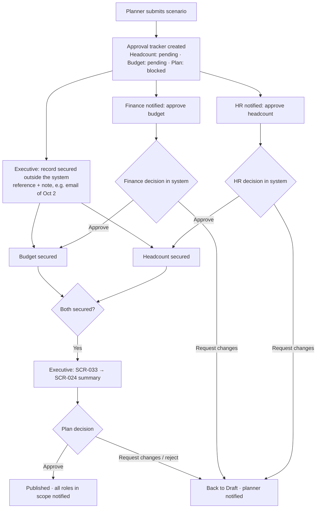

**J2 — Planner refreshes a plan after new data**

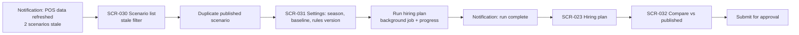

**J3 — Planner investigates lane-capacity pressure**

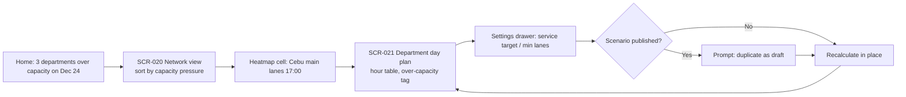

**J4 — Store manager handles an emergency off**

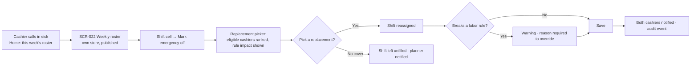

On laptop and tablet the store manager can also change shift times, add a cover shift, remove a shift and swap two cashiers. On mobile only the emergency off and replacement are available.

**J5 — HR works the recruiting timeline**

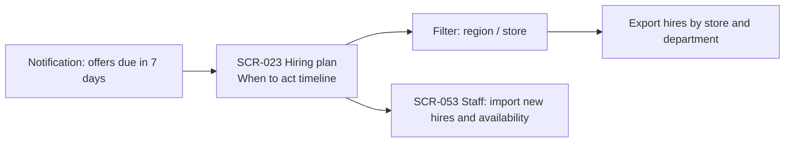

**J6 — Rules steward publishes a new wage order**

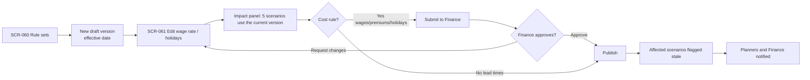

**J7 — First sign-in with a passkey**

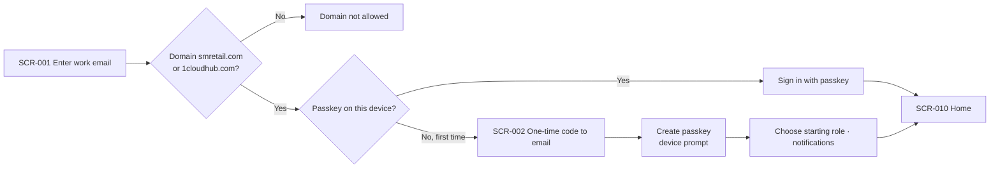

**J10 — Cover an open shift from nearby stores (Uber-style matching)**

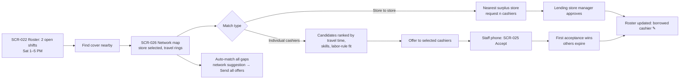

**J8 — Staff checks their roster**

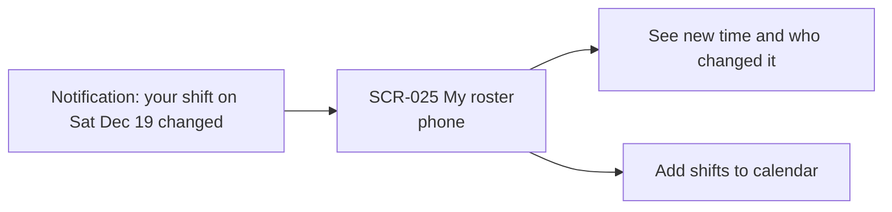

**J9 — Admin assigns a production role** (used when demo mode is switched off)

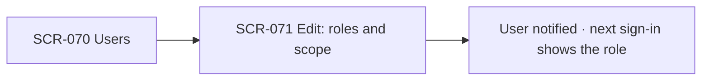

**J11 — Staff time-off / swap request**

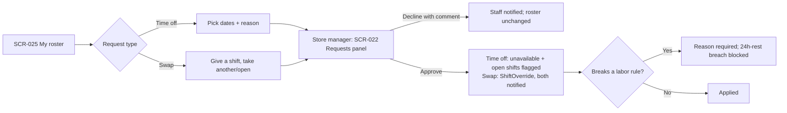

### Screen wireframes (ASCII)

The clickable HTML wireframes in `wireframes/` are the reference. The sketches below show structure only.

**SCR-001 Sign in**
```
            ┌──────────────────────────────────────┐
            │          SM Cashier Planner           │
            │  Work email [ juan@smretail.com   ]   │
            │  [   Sign in with a passkey   ]       │
            │  New here or new device? Continue →   │
            │  Only smretail.com and 1cloudhub.com  │
            └──────────────────────────────────────┘
States: domain not allowed · passkey cancelled/failed ("Try again" / "Use email code")
        session expired · browser without passkey support
```

**SCR-002 First sign-in / new device**
```
Step 1 of 3  Verify email  — code sent to juan@smretail.com  [ _ _ _ _ _ _ ]  Resend
Step 2 of 3  Create a passkey — "Use Face ID, fingerprint or your device PIN" [Create passkey]
Step 3 of 3  Start as [Planner ▾] (demo: you can switch any time) · Notifications [x] in-app [x] email
                                                                       [ Continue ]
```

**SCR-010 Home (planner variant)**
```
Good morning, Ana                           Scenario: Christmas 2026 v3 (Published)
┌ Needs attention ───────────────────────┐ ┌ Deadlines ───────────────────┐
│ ⚠ 2 scenarios stale (POS refresh)      │ │ Oct 5  Offers due    (5 d)   │
│ ⚠ 3 depts over lane capacity Dec 24    │ │ Oct 12 Training start        │
│ ⓘ Draft v4 run complete                │ │ Nov 2  Wave 1 on lanes       │
└────────────────────────────────────────┘ └──────────────────────────────┘
[KPI Seasonal hires][KPI Peak team][KPI First needed][KPI Season cost]
Recent scenarios: table (name, status, updated, stale)
```
Variants: Executive shows approvals pending plus the leadership KPIs. Store manager shows this week's roster, unfilled shifts and rule-check failures for their store. HR shows timeline deadlines and hires by region. Rules steward shows data freshness and draft rule versions. Admin shows pending invites and recent audit events.

**SCR-020 Network view**
```
[Context: Scenario ▾ | Region ▾ | Format ▾ | Store ▾ | Date 2026-12-19 ▾] [Settings ⚙] [Export ▾]
Day chips: Sat · Dec 18–23 · Payday
[Network peak 254][Cashiers 555 (314/188/53)][Paid h 3,688][Cost ₱322k][Over cap 2/24][LY short 41%]
⚠ Over installed lanes: Cebu main lanes (needs 26, has 24, 3 h) …
┌ Stacked hourly chart by store ─────────────────────────────────────────────┐
└────────────────────────────────────────────────────────────────────────────┘
┌ Heatmap: department × hour (% of installed lanes) — click cell → SCR-021 ─┐
└────────────────────────────────────────────────────────────────────────────┘
Sort [Grouped by store ▾]
Store / department │ Fcst tx │ vs wkday │ Peak │ Lanes ▮▮▯ │ Cashiers │ Paid h │ ₱ │ LY short
▸ SM Supermarket – QC                                                       (store total)
    Main checkout lanes  ›                                                  (row → SCR-021)
```

**SCR-021 Department day plan**
```
[Context bar with Store + Department + Date]   [Open weekly roster ›] [Export ▾]
[Peak on lanes 19 @1pm][Scheduled 25][Cashier-h 296][Cost ₱…][Fcst tx 3,863][LY 6/13 h short]
┌ Hourly demand vs cashiers chart ┐
Hour │ Tx │ Erl │ On lanes │ Sched │ Util │ %≤target │ Wait │ LY tx │ LY open │ LY need │ ₱
┌ Last year staffing vs need (mini KPIs + weekly chart) ┐
┌ Shift builder: cashier × hour grid, FT/PT/Float bars, M = meal; footer req/covered/gap ┐
▸ How it works (collapsible)
```

**SCR-022 Roster** — visual planner (see Visual planning components)
```
[Context bar]   ‹ Sat, Dec 19, 2026 ›      [Day | Week | Fortnight | Four weeks | Month]   [Auto-build] [Export]
⚠ 2 open shifts Sat 1–5 PM   [Find cover nearby → SCR-026]  [Offer to eligible staff]
DAY VIEW
Cashier (skills)      │ 7a  8a  9a  10a 11a 12p 1p  2p  3p  4p  5p  6p  7p  8p  9p  10p
Staffing vs need      │  0  −1   0  +1   0   0  −2  −2  −1   0  +1   0   0   0   0   0
☐ FT-01 Isa  [Main][Exp]│      [H▓▓▓▓▓▓▓▓▓M▓▓▓▓▓▓▓▓]
☐ PT-02 Maria [Main]  │               [▓▓T▓▓▓▓M▓▓▓▓▓▓] ✎
  FT-07 Ralph         │ ░░░░░░░░░░░░░░ Day off ░░░░░░░░░░░░░░░░
☐ XS-14 Jo (borrowed, Megamall 22 min)│     [▓▓▓▓▓▓▓] ✎
Required on lanes     │ ▁ ▂ ▃ ▄ ▅ ▆ ▆ ▅ ▅ ▅ ▆ ▆ ▅ ▃ ▂ ▁
             [ 2 shifts selected × | ✎ Edit | Reassign | Time off | Copy to… ]   ← bulk bar
Click a bar → shift editor: start/end, activities (meal, training, huddle, + add), rule check, Emergency off / reassign tab.
WEEK VIEW
┌ Totals ────┐ │ Mon 14   Tue 15   …   Sat 19          │ ┌ Departments ☑ Main ☑ Express ☑ CS ┐
│ 112 shifts │ │ [M 09:00 18:00]  …  [M 12:00 21:00 ✎] │ │ Colour by: department / contract / │
│ ₱98,600    │ │ Open shifts:          [! 13:00 17:00 ×2]│ │ home store                         │
│ 2 open     │ └──────────────────────────────────────┘ └────────────────────────────────────┘
MONTH VIEW: calendar tiles with shifts per day and open-shift count.
```

**SCR-026 Network map — Metro Manila**
```
[Scenario ▾] [Date] [Window 1–5 PM ▾] [Department ▾] [Travel by: public transport ▾] [Max 30 min ▾]   [Charts and table | ◉ Map]
┌──────────────────── map ─────────────────────────────┐ ┌ Selected: SM Megamall · Mandaluyong ─────┐
│ Layers ☑ Stores ☑ Available cashiers ☑ Travel rings   │ │ Needs 4 more · 26 needed · 22 rostered    │
│ [Auto-match all gaps]                                  │ │ Borrow from a nearby store                │
│        (−3) North EDSA      ●  ○                       │ │  SM Aura +3 · 18 min      [Request 3]     │
│  (−1) Valenzuela     ●    (+1) Araneta                 │ │  SM Center Pasig +2 · 14 m [Request 2]    │
│ Manila Bay  (+2) Manila   ((( −4 Megamall )))  ● ●    │ │ Available cashiers ≤ 30 min               │
│         (−2) MOA   ( 0) Makati  (+3) Aura ⇢            │ │ ☑ XS-14 Shaw · 12 min · ✓ 32/48 h         │
│      (−1) Southmall                  Laguna de Bay     │ │ ☑ PT-41 Pasig · 16 min · ✓                │
│ ● available  ○ near weekly limit  ⇢ store lends        │ │ ☐ PT-19 Aura · 29 min · ⚠ not trained     │
└────────────────────────────────────────────────────────┘ │ [Offer shift to 3 selected]               │
List view: stores short of cashiers, gap, available ≤30 min, │ Offers: XS-14 ✓ accepted · PT-41 ⏳ · FL-07 ✕│
nearest surplus store, [Find cover]                          └───────────────────────────────────────────┘
```

**SCR-023 Hiring plan**
```
[Context bar]  Season [Nov 2–Dec 31 ▾]  Baseline [October ▾]   [Run plan]  [Summary ›] [Export ▾]
Run status: ▓▓▓▓▓░░░ 14/24 departments (background — you can leave this page)
Stale banner: "Settings or data changed since this run. [Recalculate]"
[Hires 284 (176/108)][Recruit 313–327][Peak team 744][First needed Nov 2][Season h][Season ₱]
┌ Hires by store bar chart ┐   ┌ When to act timeline (past = overdue) ┐
Store / department │ Baseline │ Season │ Hires │ Needed by │ Busiest wk │ Shifts │ h │ ₱ │ FT avg h/wk
```

**SCR-024 Leadership summary**
```
[Scenario: Christmas 2026 v3 · Published Oct 1 by M. Cruz]     [Print / PDF] [Share link]
Christmas 2026 cashier hiring plan                           [Illustrative: sample data]
Bottom line callout
[5 KPIs]
When: action timeline with status pills │ Where: hires by store table
Decisions requested                      │ Risks and trade-offs
How to read these numbers (assumptions, method)
(Approver view adds: [Approve] [Request changes] [Reject])
```

**SCR-025 My roster (staff, phone-first)**
```
Hi Maria · SM Supermarket QC · Main lanes
This week  ┌ Mon 14  Rest day ┐ ┌ Tue 15  3p–7p ┐ ┌ Sat 19  12p–9p · meal 4p ✎ changed ┐
Next week  …
Changes: Sat 19 moved from 1p–5p to 12p–9p by R. Lim (store manager), Dec 18 18:02
[Add to calendar]
```

**SCR-025 My roster — shift offers** (added to the sketch above)
```
Open shift offers near you
SM Megamall · Main lanes · Sat Dec 19 · 1–5 PM · 22 min · ₱348 + ₱80 transport · expires in 24 min  [Decline] [Accept]
```

**SCR-030 Scenario list**
```
[Search scenarios]  Status [All ▾]  Season ▾  Owner ▾  [x] Stale only       [+ New scenario]
Name                    │ Status        │ Season      │ Rules ver │ Data as of │ Owner │ Updated │ ⋯
Christmas 2026 v3  ★    │ Published     │ Nov 2–Dec 31│ 2026.2    │ Sep 28     │ Ana   │ Oct 1   │ ⋯
Christmas 2026 v4       │ Draft · Stale │ Nov 2–Dec 31│ 2026.2    │ Sep 28     │ Ana   │ Oct 3   │ ⋯
⋯ menu: Open · Duplicate · Compare · Submit · Archive
```

**SCR-031 Scenario settings** (full page; also opens as a drawer on planning screens)
```
Christmas 2026 v4 · Draft                         [Discard] [Save] [Save and run]
Section nav: Demand · Service and labor · Shift rules · Labor rules · Rules version · Notes
Demand:  YoY growth [4%]; per-department overrides table (baseline tx, handle time, uplift)
Service: % within [90] seconds [60]; shrinkage [1.30]; min lanes [1]; base rate from rules ver
Shift:   FT length [8h + 1h meal]; [x] PT shifts, length [4h], cap [40%]; meal after [3h]; reserve [8%]
Labor:   FT max [6 d / 48 h]; PT max [5 d / 30 h]; rest [10 h]; max run [6]; [x] preferred rest day
Rules version: [2026.2 (published Sep 15) ▾]   Data snapshot: [POS as of Sep 28 ▾]
Changed fields are marked "edited" with the default shown beside them.
```

**SCR-032 Compare scenarios**
```
A [Christmas 2026 v3 (Published) ▾]   vs   B [Christmas 2026 v4 (Draft) ▾]
KPI deltas: Hires 284 → 251 (−33) · Peak team 744 → 718 · Cost ₱13.6M → ₱13.1M
Settings diff (only changed): FT max days 6 → 5 · FT max hours 48 → 40
By store: table with A, B, Δ for hires and cost
```

**SCR-033 Approval review** (variants for Executive, HR and Finance)
```
Christmas 2026 v4 · submitted by Ana · Oct 3 · "Stricter labor rules per HR guidance"
Approval tracker
  1 Headcount  (HR)        ✓ Approved by L. Tan, Oct 4 — "251 seasonal, OK"
  2 Budget     (Finance)   ✓ Secured outside the system — recorded by M. Cruz, Oct 4, ref "email 2 Oct"
  3 Plan       (Executive) ● Ready for your decision
Summary preview (SCR-024) │ Changes vs published (SCR-032 digest)
Checks: ✓ run complete ✓ not stale ✓ all shifts filled ⚠ 2 depts over capacity Dec 24
Comment [__________]                 [Reject] [Request changes] [Approve and publish]
```
HR sees the headcount step (hires by store and role) with Approve / Request changes. Finance sees the budget step (season cost by store) with Approve / Request changes. The Executive sees "Record as secured outside the system" on steps 1–2 while they are pending; the plan buttons stay disabled until both are secured.

**SCR-040 Notifications**
```
[All] [Unread] [Approvals] [Plans] [Data] [Rules]              [Mark all read] [Preferences]
● ⚠ Offers due in 5 days — Christmas 2026 v3            Oct 1 · Hiring plan ›
● ⓘ Run complete — Christmas 2026 v4                    Oct 3 · Open ›
  ✓ POS ingestion succeeded (47,548 rows)                 Sep 28 · Data ›
```

**SCR-041 Search results**
```
Results for "cebu"      [All] [Stores 1] [Departments 3] [Scenarios 0] [Staff 12] [Pages 0]
Stores:       SM Supermarket – Cebu City (Visayas)            › Network view filtered
Departments:  Main checkout lanes · Cebu City                 › Department day plan
Staff:        FT-03 · Cebu City · Main lanes                  › Staff record
```

**SCR-050 Data sources and ingestion**
```
Dataset          │ Source      │ Rows    │ Covers         │ Last load │ Status │ Synthetic
POS hourly       │ Upload/API  │ 47,548  │ Aug 1–Dec 31 25│ Sep 28    │ ✓      │ Yes
Store master     │ Upload      │ 8       │ —              │ Sep 20    │ ✓      │ Yes
Staff roster     │ HRIS        │ 463     │ —              │ —         │ Not set│ —
[Upload file]   Ingestion history: time, dataset, user, rows, errors, warnings, result
```

**SCR-051 Upload and validation**
```
Step 1 Choose dataset + file → Step 2 Map columns → Step 3 Validate → Step 4 Confirm
Validation: ✓ 47,540 rows ok  ⚠ 8 warnings (lanes open > installed)  ✕ 0 errors  [Download report]
Impact: 3 scenarios will be marked stale                        [Cancel] [Load data]
```

**SCR-052 Stores, departments, lanes**
```
[Search] Region ▾ Format ▾                                        [+ Store] [Import]
Store ▸ Departments: name │ installed lanes │ handle time default │ trading hours │ active
```

**SCR-053 Staff and availability**
```
Store [QC ▾] Department ▾ Type [FT/PT] [Search name/ID]            [Import] [+ Staff]
ID │ Name │ Type │ Dept │ Preferred rest │ Availability pattern │ Unavailable dates │ Active
Row → side panel: weekly availability grid, date exceptions
```

**SCR-060 Rule sets**
```
Rule set                 │ Current version │ Effective │ Draft │ Used by scenarios
Holiday calendar 2026    │ 2026.2          │ Jan 1     │ —     │ 5
Wage rates (by region)   │ 2026.1          │ Jul 16    │ 2026.2│ 5
Premium pay multipliers  │ 2025.1          │ —         │ —     │ 5
Planning lead times      │ 1.0             │ —         │ —     │ 5
```

**SCR-061 Rule version editor** (cost rules need Finance approval)
```
Wage rates · Draft 2026.2 [Cost rule]     RST: [Discard][Save draft][Submit to Finance]
                                          FIN: [Request changes][Approve and publish]
Approval: 1 Submitted ✓ · 2 Finance approval ● pending · 3 Published —
Region │ Base rate ₱/h (was) │ Night differential │ Source (wage order ref)
Impact: 5 scenarios use 2026.1 → they will be flagged stale on publish (list)
Change note [required]                    Non-cost rules skip steps 1–2 and publish directly.
```

**SCR-070 Users / SCR-071 Invite or edit**
```
[Search] Role ▾ Status ▾                                           [+ Invite user]
Name │ Email │ Roles │ Scope │ Last sign-in │ Status │ ⋯ (Edit · Deactivate · Resend)
Invite: Email [ ] Roles [x] Planner [ ] HR … Scope: ( ) Global (•) Region [Luzon ▾] ( ) Store
```

**SCR-072 Roles and permissions:** the read-only RBAC matrix above, with a description per role.

**SCR-073 Audit log**
```
Date range ▾ User ▾ Event type ▾ Object [search]                         [Export CSV]
Time │ User │ Event │ Object │ Detail (before → after)
Oct 3 10:14 │ Ana │ scenario.submitted │ Christmas 2026 v4 │ —
```

**SCR-080 Profile and preferences**
```
Profile (from SSO, read-only) · Default scope [QC ▾] · Number format [₱ 1,234]
Notifications: event × channel (in-app / email) toggles, email digest [daily ▾]
```

### Cross-cutting patterns

**Authentication (Amazon Cognito user pool, passkeys)**
- Sign-in is **passkey only** (WebAuthn/FIDO2 through Cognito). No passwords.
- **Allowed email domains:** `smretail.com` and `1cloudhub.com`. The domain is checked on the sign-in page and enforced by the user pool at sign-up (e.g. a pre-sign-up trigger). Other domains see "This work email domain isn't allowed."
- **First sign-in or new device:** the user verifies their email with a one-time code, then creates a passkey. The email code is used only to register or recover a passkey, never as a standing login method (Q14).
- **Self sign-up** is allowed for the two domains for any email on the allowlist; new users land on Home with the role switcher and no admin approval (Q15).
- Users manage passkeys in SCR-080 (list devices, add, remove; they can't remove the last one).
- Idle timeout at 60 minutes. A warning dialog appears 2 minutes before, with "Stay signed in". After timeout, the user returns to the same URL on sign-in.
- Unsaved scenario edits are kept as a local draft through a timeout.
- Browsers without passkey support see a message listing supported browsers and devices.

**Role switcher (demo mode)**
- Every user can switch between the 8 roles from the top bar ("Viewing as"). The choice persists per user and is sent with every request, so the server applies that role's permissions and scope.
- Each role uses a demo scope: Planner = all regions; Store Manager = SM Supermarket – Quezon City; Staff = a sample cashier (PT-02, QC main lanes); the others = global.
- Actions are audited with both the signed-in user and the active role ("Ana as Executive approved…").
- Switching keeps the current page if the new role can see it; otherwise it goes to Home.
- Demo mode is a configuration flag. When it is off, the switcher is hidden and roles come from SCR-070/071 assignments.

**Visual planning components**

| Component | Used in | Behaviour |
|---|---|---|
| Day timeline | SCR-022 Day view, SCR-021 shift builder | Rows = cashiers (avatar, contract, skills); columns = hours; bars = shifts coloured by department; activity segments inside bars (meal, training, huddle); staffing-vs-need strip (−n red, +n amber) above; required-on-lanes bars below |
| Shift editor | Timeline bar or week chip | Start/end, activities (add/remove), live rule check, Emergency off / reassign tab with ranked replacements and "Find cover nearby" |
| Direct manipulation | Day timeline | Drag to move, drag edges to resize (15-min snap), multi-select rows for bulk Edit / Reassign / Time off / Copy to. Keyboard alternative: every action is available from the shift editor; arrow keys move focus between bars |
| Week grid | SCR-022 Week, Fortnight, Four weeks | Chips per cashier per day with a department colour band and letter, start/end times; rest day, unavailable and open-shift chips; totals panel (shifts, cost, hours, open, borrowed); department filters; colour by department, contract or home store |
| Month coverage | SCR-022 Month | Calendar tiles with shifts and open-shift count; click a day to open the Day view |
| Zoom switch | SCR-022 | Day · Week · Fortnight · Four weeks · Month, with a date navigator |

- Colours are placeholder data colours for categories, always paired with a letter or label (never colour alone). The final palette is part of the style guide (SG-004, SG-010).
- Phones: the Day view becomes a list per cashier, the Week view a list per day. Only Emergency off / reassign is editable (Mobile interaction policy).

**Cross-store matching (network map)**

- **Scope:** Metro Manila stores in phase 1 (the demo uses the SM malls listed on Wikipedia's "List of shopping malls in Metro Manila"; positions approximate until geocoded).
- **Demand:** open shifts and under-covered hours per store, department and time window, from the published roster and the Erlang C requirement.
- **Supply:** cashiers who are off, on a rest-day-free day, or in the float pool, are trained on the department, and would stay within labor rules (days, weekly hours, rest ≥ 10 h, consecutive days) **counted across all stores**.
- **Distance:** travel time from the cashier's **home area (barangay)** to the store, by public transport or car, precomputed as a matrix per time window. Rings on the map show 15/30/45 minutes around the selected store (schematic circles in the wireframe; real isochrones in the build).
- **Ranking:** travel time, then labor-rule headroom, then fairness (fewest extra shifts this period), then cost (overtime or premium day).
- **Two ways to cover a gap:**
  1. **Offer to cashiers:** the planner or store manager selects candidates; offers go to their phones (SCR-025); first acceptance wins; the others expire; offers expire after 30 minutes by default.
  2. **Borrow from a store:** request n cashiers from the nearest surplus store; its store manager approves and picks who goes.
- **Auto-match all gaps:** proposes a network-wide set of offers and store-to-store moves that covers the most open shifts with the least total travel; the planner reviews and sends them.
- **Privacy (RA 10173):** home area is opt-in, stored at barangay level only, never an exact address, and staff can stop sharing at any time. There is no live location tracking. Store managers see candidates from other stores as IDs, home store and barangay only; the name is revealed once an offer is accepted.
- **Borrowed cashiers** appear in the receiving store's roster marked with their home store and travel time, and their hours count toward their own weekly limits.

**Scenario and approval lifecycle**

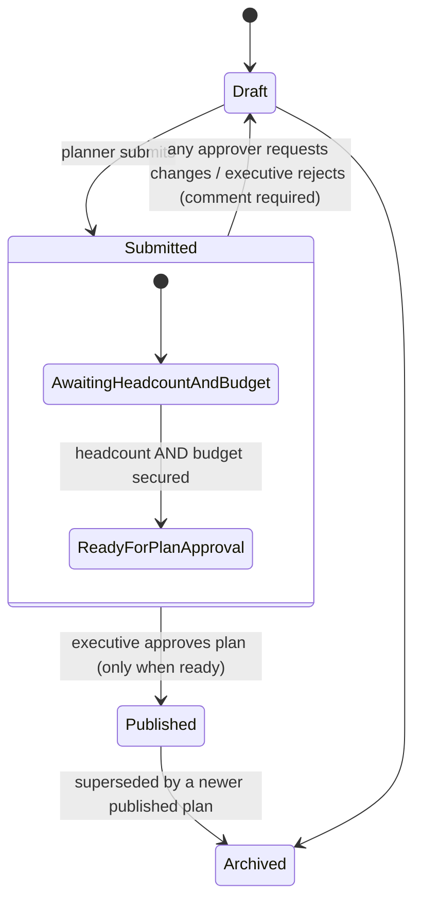

Approval steps for a submitted scenario:

| Step | Approver | Can be recorded outside the system | Required before |
|---|---|---|---|
| 1 Headcount | HR | Yes, by the Executive, with a reference and note | Step 3 |
| 2 Budget | Finance | Yes, by the Executive, with a reference and note | Step 3 |
| 3 Plan | Executive | No | Publishing |

- Steps 1 and 2 can happen in either order or at the same time. HR and Finance see every step's status, including records made outside the system.
- If a scenario returns to Draft and is resubmitted, all steps reset.
- At most one **Published** scenario per season. It is the default on every planning screen and is marked ★.
- **Stale** is a flag, not a state. It is set when the scenario's data snapshot or rules version is older than the latest published version, or when its settings changed after the last run. Stale scenarios show a banner with "Recalculate". A stale scenario cannot be submitted; a submitted one that becomes stale is paused and the approvers are notified.
- Published and submitted scenarios are read-only. Editing starts with "Duplicate as draft".
- **Rule-version publishing:** a wage or cost-affecting rule version (wages, holiday multipliers, premiums) requires **Finance approval** before it can be published; the Rules Steward submits, Finance approves or requests changes, and only then does it go live. Non-cost rules (lead times, operational parameters) are published directly by the Rules Steward with Finance notified.
- **Store manager roster changes** (emergency off, reassign, time change, add or remove a shift) apply to the published roster as operational overrides. They don't need approval, are audited, are marked ✎ in the grid, and notify the affected cashiers. A change that breaks a labor rule needs a reason and shows in the labor-rule checks.

**Notifications**

| Event | Recipients | In-app | Email | Severity |
|---|---|---|---|---|
| Headcount approval requested | HR | ✓ | ✓ | Action |
| Budget approval requested | Finance | ✓ | ✓ | Action |
| Headcount / budget secured (in system or recorded outside) | Executives, HR, Finance, submitter | ✓ | ✓ | Info |
| Plan ready for executive approval | Executives | ✓ | ✓ | Action |
| Approved / changes requested / rejected (any step) | Submitter, other approvers, planners in scope | ✓ | ✓ | Info / Action |
| Plan published | All roles in scope | ✓ | ✓ | Info |
| Hiring milestone due in 7 days / overdue | HR, planners | ✓ | ✓ | Warning / Critical |
| Scenario stale (data or rule change) | Scenario owner | ✓ | ✓ | Warning |
| Background run complete / failed | Requester | ✓ | Only if failed | Info / Critical |
| Lane capacity exceeded in published plan | Planners, store managers in scope | ✓ | ✓ | Warning |
| Unfilled roster shifts in published roster | Store manager, planner | ✓ | ✓ | Warning |
| Data ingestion succeeded / failed | Rules steward, planners | ✓ | Only if failed | Info / Critical |
| Rule version published | Planners, Finance, HR | ✓ | ✓ | Info |
| Roster published / your shift changed | Staff (own shifts) | ✓ | ✓ | Info |
| Open-shift offer (with store, time, travel, pay, expiry) | Selected staff | ✓ push | ✓ | Action |
| Offer accepted / declined / expired | Sender (planner or store manager) | ✓ | — | Info |
| Staff borrow request | Lending store manager | ✓ | ✓ | Action |
| Borrow approved / declined | Requesting store manager, planner | ✓ | — | Info |
| Manager roster change with a rule override | Planner, HR | ✓ | ✓ | Warning |
| New passkey added to your account | User | ✓ | ✓ | Security |
| User invited (production mode) | Invitee | — | ✓ | — |

- The bell shows the unread count and the latest 5, each with a deep link. The full list is SCR-040.
- Email is sent immediately per event (Amazon SES); there is no daily digest (Q7). Users can turn off email per event, except approvals and critical items, which stay on.
- Scope filtering applies: a store manager is only notified about their stores.


**Language (English + Filipino)**
- The UI ships in English and Filipino. A language switcher sits in the top bar and in Profile (SCR-080); the choice persists per user.
- All UI text, dates, numbers and ₱ formatting come from externalised resource bundles (en, fil). No user-facing string is hardcoded.
- Staff-facing screens (My roster, offers, notifications, requests) are the priority for translation; admin screens follow.
- Emails and push notifications use the recipient's language preference.

**Search and filter**
- **Global search** in the top bar, opened with `/` or ⌘K. Results are grouped (stores, departments, scenarios, staff, pages) and filtered by the user's scope. Up to 5 per group in the dropdown; Enter opens SCR-041.
- **Context bar** on planning screens, in this order: Scenario · Region · Format · Store · Department · Date or Season. Each screen shows only the filters that apply to it. Filters narrow from left to right (e.g. picking a region limits the store options).
- **URL state:** every filter and sort is in the URL (`?scenario=…&region=…&store=…&dept=…&date=…&sort=…`), so any view can be shared or bookmarked.
- **Saved views:** name the current filters and sort; optionally set as the default for that screen.
- **Tables:** column sort by clicking the header (`aria-sort`); in-table text filter for lists over 20 rows; sticky header and first column; pagination at 50 rows for admin and data lists; planning tables are grouped, not paginated.
- Scope is enforced by the server, never only by hiding filter options.


**Staff requests (time off and swaps)**
- From My roster (SCR-025), a Staff user can raise a **time-off request** (date range, reason, optional note) or a **swap request** (offer one of their shifts and pick a colleague's shift or an open slot).
- Requests go to the **store manager** for the affected store (SCR-022 gets a Requests panel and a notification). The manager approves or declines with a comment.
- An approved time-off request marks the cashier unavailable for those dates and flags any shifts it now leaves open. An approved swap applies as a ShiftOverride (reassign / time) with both cashiers notified; a swap that breaks a labor rule follows the same warn-and-reason / hard-block rule as manager edits (Q17).
- Requests are audited. Pending requests never change the roster until approved. This is new in phase 1 (beyond the prototype).

**Long-running calculations**
- Network view, department plan and a roster of up to 4 weeks should feel immediate (target defined in the NFRs).
- The hiring plan and rosters longer than 4 weeks run as background jobs. The user sees a progress bar with a department count, can leave the page, and is notified on completion. Results are cached per scenario version.

**States and feedback**

| State | Pattern |
|---|---|
| Loading | Skeletons for KPIs and tables; charts show a labeled placeholder |
| Empty | Explains why and what to do: "No published plan for this season yet. [Open scenarios]" |
| No access (in scope) | "You don't have access to this store." Never shows partial data |
| Error | Inline message with a retry and a reference ID; form fields show field-level errors |
| Stale | Info banner with the reason and a Recalculate action |
| Unsaved changes | Leaving the page prompts "Discard changes?" |
| Destructive actions (deactivate, archive, publish rules) | Confirmation dialog naming the object and its effect |
| Success | A toast for 5 s (announced via `aria-live="polite"`); the result is also visible on the page |

**Sample-data provenance**
- A banner on every page while any dataset in use is flagged synthetic. Exports include a "SAMPLE DATA" header row. The printed summary shows the badge.
- The flag is set per dataset in SCR-050 and can only be cleared by a Rules Steward.

**Export**
- CSV for every table view. It respects the current filters and scope, and includes a header block with the scenario, rules version, data snapshot, time of export and user.
- The leadership summary exports to PDF/print (A4).
- Exports are recorded in the audit log.

**Accessibility (target WCAG 2.2 AA)**
- Landmarks (`header`, `nav`, `main`), skip link, visible focus.
- Every chart has a data table alternative ("View as table") and a text summary of the key point.
- The heatmap never uses color alone; each cell shows its value.
- Roster grids use table semantics with row and column headers. Cell actions are buttons with labels such as "Mark PT-02 unavailable on Saturday Dec 19".
- Status pills pair text with color.
- Full conformance needs manual testing with assistive technologies; the wireframes only establish the structure.

## Data Models

Conceptual entities the screens depend on. Fields are indicative; the data dictionary (DOM-002) will define them.

| Entity | Key fields | Notes |
|---|---|---|
| User | id, email, name, status, lastSignIn, activeRole, language | Cognito user pool identity; activeRole used in demo mode; language en/fil |
| Passkey | userId, credentialId, deviceLabel, createdAt, lastUsedAt | Managed by Cognito; listed in SCR-080 |
| RoleAssignment | userId, role, scopeType (global/region/store), scopeIds | Multiple per user |
| Store | id, name, format, region, active | |
| Department | id, storeId, name, installedLanes, defaultHandleTime, tradingHours | |
| Dataset / Snapshot | id, type (POS, master, staff), coversFrom/To, rowCount, synthetic, loadedAt | Scenarios pin a snapshot |
| IngestionRun | id, datasetType, user, file, rows, warnings, errors, status | |
| RuleSet / RuleVersion | ruleSetType, version, effectiveFrom, status (draft/submitted/published), payload, changeNote, financeApprovedBy | Cost rules need Finance approval (Q6) |
| Scenario | id, name, season, status, stale, ownerId, rulesVersionId, snapshotId, settings, parentScenarioId | Settings = all v3 inputs |
| ScenarioRun | scenarioId, type (network/department/roster/hiring), status, progress, resultsRef, startedAt | |
| ApprovalStep | scenarioId, submissionNo, step (headcount/budget/plan), status, decidedBy, decidedAsRole, decision, comment, outsideSystem, reference | |
| Staff / Availability | staffId, storeId, deptId, type, preferredRestDay, pattern, exceptions, email, userId | Replaces v3 simulated staff; email links a Staff user |
| ShiftOverride | rosterId, shiftId, type (emergency off, reassign, time, add, remove), fromStaff, toStaff, reason, ruleBreaches, by, at | Manager changes to a published roster |
| StaffRequest | id, staffId, type (time-off/swap), dateRange, offeredShiftId, targetShiftId, note, status (pending/approved/declined), decidedBy, decidedAt | Staff self-service requests (Q18) |
| StoreLocation | storeId, lat, lon, geocodedAt, source | Demo positions approximate |
| StaffHomeArea | staffId, barangay, city, centroidLat, centroidLon, consentAt, maxTravelMin, crossStoreOffers | Opt-in; barangay level only |
| TravelTime | homeArea, storeId, mode (public transport/car), window, minutes, computedAt | Precomputed matrix |
| ShiftOffer | offerId, shiftId, staffId, sentBy, sentAt, expiresAt, status (sent/accepted/declined/expired/withdrawn), travelMin, allowance | One acceptance per shift |
| TransferRequest | fromStoreId, toStoreId, window, count, status, decidedBy, staffIds | Store-to-store borrowing |
| Notification | id, userId, event, objectRef, severity, readAt | |
| NotificationPreference | userId, event, channel, enabled | |
| SavedView | userId, screen, name, query, isDefault | |
| AuditEvent | at, userId, event, objectType, objectId, before, after | Immutable |

### Demo data

Demo mode ships with seeded mock data so every role and journey works without real SM data. All seeded records carry `synthetic = true`, show a "Demo data" badge, and are never mixed with uploaded real data in the same snapshot.

| Seed set | Contents |
|---|---|
| Stores | The 27 Metro Manila SM malls (A-010), each with departments, lanes, trading hours and approximate coordinates |
| Staff | About 25–40 cashiers per store with names, types, rest days, availability, home barangay (consented) and a `demo.local` email |
| Transactions | Synthetic POS history per department, generated with the prototype v3 profiles, covering last season and the forecast window |
| Scenarios | One of each lifecycle state: Draft, Submitted (headcount approved, budget pending), Approved, Published ★, Superseded, including an off-system budget record |
| Roster activity | Published rosters with sample ShiftOverrides (emergency off, reassign), open gaps, sent/accepted/expired offers and one TransferRequest |
| Notifications and audit | Sample notifications per role and a matching audit trail |

- **Staff persona:** real sign-ins use smretail.com / 1cloudhub.com emails, which won't match seeded staff. When a demo user switches to Staff, they pick a demo cashier from a short list ("Viewing as Staff · Ana Reyes (demo)"). Outside demo mode, linking is by work email only (Q16).
- **Reset:** an Administrator can reset demo data to the seed from SCR-050; the reset is audited and notifies signed-in users.
- Seed generation is deterministic (fixed random seed) so tests and walkthroughs see the same numbers.

## Correctness Properties

These properties must hold across the design and will become testable requirements.

### Property 1: Scope isolation

**Validates: Requirements 2.2, 5.1, 11.1, 20.4, 21.1, 24.1, 25.1**

for any user and any screen, search result or export, every store shown is within that user's scope.

### Property 2: Prototype parity

**Validates: Requirements 4.1, 4.2, 10.1**

for the same data snapshot, rules version and settings, the rebuild's forecast, lanes, roster and hiring-plan outputs match prototype v3.

### Property 3: Single published plan

**Validates: Requirements 8.2**

at most one scenario per season is Published at any time.

### Property 4: Read-only published

**Validates: Requirements 8.3**

a Submitted or Published scenario's settings never change; edits produce a new Draft.

### Property 5: Stale correctness

**Validates: Requirements 8.4, 8.5**

a scenario is flagged stale exactly when its snapshot or rules version is superseded or its settings changed after its last run. Stale scenarios cannot be submitted.

### Property 6: Rule versioning

**Validates: Requirements 4.3, 16.1, 16.2**

results always record the rules version and data snapshot used; publishing a rule version never changes existing results.

### Property 7: Audit completeness

**Validates: Requirements 9.7, 16.6, 22.1**

every create, edit, submit, decision, publish, ingestion, export and role change produces exactly one audit event.

### Property 8: Filter round-trip

**Validates: Requirements 21.3, 21.4**

loading a URL reproduces the same filters, sort and scenario that produced it.

### Property 9: Provenance

**Validates: Requirements 18.1, 18.2, 18.3, 17.6**

while any dataset in use is synthetic, the banner appears on every page and every export carries the sample-data marker.


### Property 10: Approval sequencing

**Validates: Requirements 9.4**

a plan can be published only when the headcount and budget steps of the current submission are each approved in the system or recorded as secured outside it.

### Property 11: Staff self-scope

**Validates: Requirements 15.1, 25.3**

a Staff user sees only their own shifts, never another cashier's name, shift or cost.

### Property 12: Active-role enforcement

**Validates: Requirements 2.1, 3.2, 3.3, 22.2**

every request is authorised against the active role's permissions and scope, and the audit event records both the user and the active role.

### Property 13: Domain restriction

**Validates: Requirements 1.1, 1.2**

no account exists whose email domain is outside smretail.com and 1cloudhub.com.

### Property 14: Override traceability

**Validates: Requirements 7.2, 7.3, 7.4, 14.2**

every change to a published roster produces a ShiftOverride and an audit event, and any labor-rule breach it causes has a recorded reason; no change is saved that leaves a cashier without a 24-hour rest after 6 consecutive working days.

### Property 15: Location privacy

**Validates: Requirements 12.1, 12.2, 12.3, 12.4, 12.5**

no screen, export or API response exposes a staff member's location more precisely than barangay, and staff who have not consented (or withdrew consent) never appear on the map or in travel-based matching.

### Property 16: Offer eligibility

**Validates: Requirements 11.5, 13.1**

every cashier offered a shift is trained on the department, available in that window, and would remain within every labor rule when their hours across all stores are counted.

### Property 17: Single acceptance

**Validates: Requirements 13.3, 13.4**

at most one offer per open shift can be accepted; all other offers for that shift move to expired or withdrawn at that moment.

### Property 19: Requests do not change the roster until approved

**Validates: Requirements 15.4, 15.7**

*For any* staff time-off or swap request, the published roster is unchanged while the request is pending; only an approval by the store manager applies the change (as unavailability or a ShiftOverride), and every request and decision is audited.

### Property 18: Demo data isolation

**Validates: Requirements 19.2, 19.3, 19.5**

*For any* snapshot, scenario run or export, records are either all synthetic or all real; synthetic records are always labelled "Demo data", and resetting demo data never changes real records.

## Error Handling

| Situation | Behaviour |
|---|---|
| Email domain not allowed | Inline message on SCR-001; no account is created |
| Passkey prompt cancelled or failed | "Try again"; "Use an email code to set up a passkey on this device" |
| Lost all passkeys | Email code recovery registers a new passkey (Q14); the user is notified |
| Browser or device without passkey support | Message with supported browsers; no fallback login |
| Cognito unavailable | Sign-in page error with a retry and the support contact |
| Session expired mid-edit | Local draft kept; restored after sign-in |
| Background run fails | Scenario shows "Run failed" with the reason and a retry; the requester is notified |
| Data upload validation errors | Load blocked; downloadable error report with row numbers |
| Upload warnings only | Load allowed after explicit confirmation; warnings stored with the run |
| Roster cannot fill shifts | Shown as unfilled with reasons, never silently dropped (v3 behaviour) |
| Lane need above installed lanes | Over-capacity tag and warning with options (temporary POS, express/self-checkout, lower service level) |
| Concurrent edits to the same draft | Last save detected; the user chooses to reload or save as a copy |
| Travel-time service unavailable | Map shows straight-line distance with a "travel times unavailable" banner; ranking falls back to distance |
| No eligible candidates within the travel limit | Panel suggests widening the limit, borrowing from a surplus store, or accepting a lower service level |
| Two cashiers accept the same offer | The first acceptance wins; the second sees "This shift has just been filled" |
| Lending store becomes short after approving a transfer | Warning to both store managers before confirming |
| Out-of-scope deep link | "No access" state; nothing about the object is revealed |

## Testing Strategy

- **Wireframe review:** walk each journey (J1–J7) through the clickable wireframes with a representative of each role.
- **Usability checks** on the five highest-traffic screens: Home, Network view, Department day plan, Weekly roster and Hiring plan.
- **Accessibility:** automated checks on the built screens plus manual screen-reader and keyboard testing of the roster grids, the heatmap alternative and dialogs.
- **Parity suite:** golden outputs from prototype v3 for the dates it was checked on (the 24 departments × 9 dates including Christmas Eve, Christmas Day, Rizal Day and paydays).
- **Property-based tests** for the correctness properties (scope isolation, lifecycle, stale flag, filter round-trip).
- Full strategy: `docs/07-tech-stack/02-testing-strategy.md` (TS-002).

## Open Questions and Decisions

**Decided (v0.5.0)**

| # | Decision |
|---|---|
| Q1 | Amazon Cognito user pool with passkey-only sign-in, restricted to smretail.com and 1cloudhub.com |
| Q2 | 8 roles: the 7 proposed plus Staff (own roster only). Demo mode: every user can switch role |
| Q3 | HR approves headcount and Finance approves budget before the Executive approves the plan; headcount/budget can be recorded as secured outside the system, visible to HR and Finance |
| Q5 | Store managers manage shifts directly on the published roster (emergency offs, reassign, times, add/remove) |
| Q10 | All screens work on phones; read-only except approvals and quick actions (see Mobile interaction policy) |
| Q20 | Cross-store sharing is in scope (network map, offers, store-to-store borrowing) |
| Q21 | Matching uses the staff member's home area, not live location |
| Q15 | Self sign-up for any email on the smretail.com / 1cloudhub.com allowlist; no admin invite |
| Q16 | Staff users link to their staff record by work email; demo mode uses seeded mock staff with a persona picker |
| Q17 | Labor-rule breaches on manual edits warn and require a reason; only a missed 24-hour rest after 6 consecutive days is blocked |
| Q19 | Only the Executive can record headcount/budget as secured outside the system |
| Q4 | Store managers see ₱ cost for their own store only |
| Q6 | Wage/cost-affecting rule changes need Finance approval before publishing; other rules publish directly (rules steward), Finance notified |
| Q7 | Amazon SES; notifications sent immediately, no daily digest |
| Q8 | SM brand (colours, logo, typography) — needs SM brand guidelines; wireframes stay grayscale |
| Q9 | English and Filipino from launch, with a language switcher; all strings externalised |
| Q11 | File upload only in phase 1 (POS, master data, staff); integrations later |
| Q12 | 60-minute idle timeout, 2-minute warning dialog |
| Q13 | Audit retained 5 years; ingestion files 1 year |
| Q14 | Passkey bootstrap/recovery via email one-time code, used only to register or recover a passkey (verify exact Cognito flow in TS/SEC docs) |
| Q18 | Staff can raise time-off and shift-swap requests, each routed to the store manager for approval (new in phase 1) |
| Q22 | Amazon Location Service for maps and car travel times; public-transport times estimated via a speed factor until a transit source is chosen |
| Q23 | Flat transport allowance by travel band, configured in business rules (DOM-003) |
| Q24 | Lending store manager approves cross-store borrowing; a planner may override with a recorded reason |
| Q25 | Offers broadcast to the eligible group; first acceptance wins; 30-minute expiry |
| Q26 | All SM Markets (Supermarket, Hypermarket, SaveMore) and SM Store checkouts in Metro Manila, filterable by format on the map |
| Q27 | Amazon Location Service maps and places for tiles and geocoding |


**No open questions remain.** All decisions above are inputs to requirements.md.
