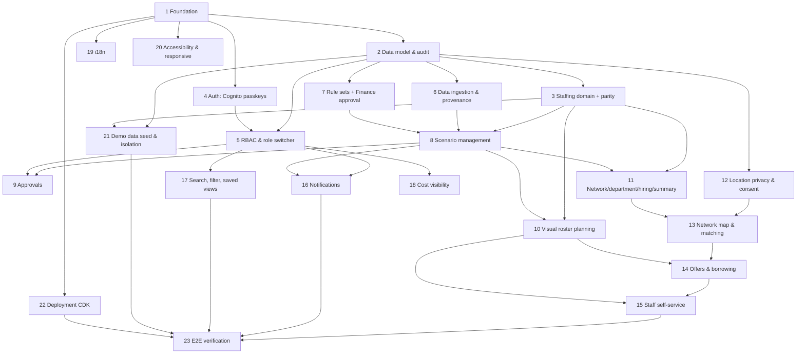

# Implementation Plan — Cashier Staffing Planner

> Derived from `requirements.md` v0.2.0 and `design.md` v0.7.0. Stack per ADR-0002 (React+TS SPA, Node+TS API, PostgreSQL, S3, SQS workers, Cognito, SES, Amazon Location Service, CDK).
> Each task lists the requirements it implements. Property-based tests (P1–P19) follow the testing strategy (TS-002).

## Overview

This plan builds the Cashier Staffing Planner from the ground up: foundation and data model, the pure-TypeScript staffing domain (with prototype parity), authentication and authorization, then each feature area (ingestion, rules, scenarios, approvals, visual planning, network map, offers/borrowing, staff self-service), the cross-cutting concerns (notifications, search, i18n, accessibility), demo data, deployment and end-to-end verification. Property-based tests for the 19 correctness properties (P1–P19) are embedded in the relevant tasks and re-verified at the end.

## Tasks

- [ ] 1. Project foundation and stack scaffold
  - Set up the React+TypeScript SPA (Vite), the Node+TypeScript API service, shared types package, linting, formatting and a test runner with property-based testing support.
  - Add CI to build, lint and test on every push; wire a CDK app skeleton for infrastructure.
  - _Requirements: NFR summary (TS-001, ADR-0002)_

- [ ] 2. Data model and persistence
- [ ] 2.1 Define the relational schema and migrations
  - Implement tables for User, Passkey, RoleAssignment, Store, Department, Dataset/Snapshot, IngestionRun, RuleSet/RuleVersion, Scenario, ScenarioRun, ApprovalStep, Staff/Availability, ShiftOverride, StaffRequest, StoreLocation, StaffHomeArea, TravelTime, ShiftOffer, TransferRequest, Notification, NotificationPreference, SavedView, AuditEvent, per DOM-002.
  - Include a `synthetic` flag on datasets and a `language` field on User.
  - _Requirements: 4, 8, 17, 19_
- [ ] 2.2 Append-only audit log
  - Implement an immutable AuditEvent store (insert-only) capturing time, user, active role, event, object and before/after.
  - Write a property test: every create/edit/submit/decision/publish/ingestion/export/role-change writes exactly one event (P7).
  - _Requirements: 22 (P7)_

- [ ] 3. Core staffing domain (pure TypeScript, prototype parity)
- [ ] 3.1 Forecast, Erlang C and shrinkage
  - Implement hourly demand forecast, Erlang C lane sizing to the service target, and shrinkage uplift per DOM-001.
  - _Requirements: 4_
- [ ] 3.2 Shift builder, roster assignment and labor rules
  - Implement shift construction, named roster assignment, and PH labor-rule checks (consecutive days, weekly hours, rest ≥ 10 h, mandatory 24-hour rest after 6 days).
  - _Requirements: 4, 6.7, 7.4_
- [ ] 3.3 Hiring plan and cost model
  - Implement seasonal team sizing, hiring waves by lead time, and the cost model from wage/premium rule versions.
  - _Requirements: 4, 10_
- [ ] 3.4 Parity test suite against DOM-001 tolerance
  - Build a golden-master/property test that runs the pipeline on the seeded demo snapshot and asserts parity with v3 per the DOM-001 tolerance table (integers exact; cost ±0.5%; roster checked on shift-set and hours).
  - _Requirements: 4 (P2, P6)_

- [ ] 4. Authentication (Cognito passkeys) and domain allowlist
- [ ] 4.1 Cognito user pool with passkey sign-in
  - Configure the user pool for WebAuthn passkey sign-in with no password path; implement first sign-in / new-device email one-time code that leads to passkey registration; passkey management (list/add/remove, block last-passkey removal).
  - _Requirements: 1.3, 1.4, 1.5, 1.6, 1.9_
- [ ] 4.2 Domain allowlist and self sign-up
  - Add a pre-sign-up Lambda enforcing smretail.com / 1cloudhub.com; enable self sign-up in demo mode; reject other domains with the specified message.
  - Write a property test: no account exists with a domain outside the allowlist (P13).
  - _Requirements: 1.1, 1.2, 1.7 (P13)_
- [ ] 4.3 Session timeout
  - Implement 60-minute idle timeout with a 2-minute warning and return-to-URL after re-auth.
  - _Requirements: 1.8_

- [ ] 5. Authorization, roles and demo role switcher
- [ ] 5.1 RBAC and scope enforcement (server-side)
  - Implement the RBAC matrix and scope model (global/region/store/self); enforce on every request; hide (not disable) inaccessible nav; "No access" state for out-of-scope deep links without leaking attributes.
  - Property tests: every shown store is in scope (P1); every request authorised against the active role, audit records user+role (P12).
  - _Requirements: 2 (P1, P12)_
- [ ] 5.2 Demo role switcher
  - Implement the "Viewing as" switcher across all 8 roles (config-flagged), applying the active role's permissions/scope to each request and keeping page or routing Home.
  - _Requirements: 3 (P12)_

- [ ] 6. Data ingestion and provenance
- [ ] 6.1 File upload and validation
  - Implement upload for POS, master and staff data to S3; validate with per-row warnings/errors and a downloadable report; block loads with errors and keep the prior dataset; record ingestion history.
  - _Requirements: 17.1, 17.2, 17.3, 17.5_
- [ ] 6.2 Snapshots, staleness signalling and synthetic flag
  - Pin datasets as snapshots; on load, compute and notify affected stale scenarios; support the synthetic flag with Rules-Steward-only clearing.
  - _Requirements: 17.4, 17.6, 8.4_
- [ ] 6.3 Sample-data provenance
  - Show the non-dismissible banner while any in-use dataset is synthetic; add the sample-data marker to every export and the printed summary.
  - Property test: while synthetic data is in use, banner on every page and marker on every export (P9).
  - _Requirements: 18 (P9)_

- [ ] 7. Business rule sets with Finance approval
- [ ] 7.1 Versioned rule sets
  - Implement effective-dated rule versions (holidays, wages, premium multipliers, lead times); scenarios record the version used; publishing never changes existing results.
  - Property test: results carry rules version + snapshot; republish doesn't alter prior results (P6).
  - _Requirements: 16.1, 16.2 (P6)_
- [ ] 7.2 Cost-rule approval flow
  - Require Finance approval before publishing a cost rule (wages/premiums/holidays); allow Rules Steward to publish non-cost rules directly; flag affected scenarios stale and notify owners, Finance and HR; audit each transition.
  - _Requirements: 16.3, 16.4, 16.5, 16.6 (P7)_

- [ ] 8. Scenario management
- [ ] 8.1 Scenario CRUD, lifecycle and single-published invariant
  - Implement create/duplicate/edit-settings/archive; enforce one Published scenario per season marked ★; make Submitted/Published settings read-only ("Duplicate as draft").
  - Property tests: at most one Published per season (P3); Submitted/Published settings never mutate (P4).
  - _Requirements: 8.1, 8.2, 8.3 (P3, P4)_
- [ ] 8.2 Staleness engine
  - Flag stale exactly when snapshot/rules superseded or settings changed after last run; block submission of stale; pause submitted scenarios that become stale and notify approvers.
  - Property test: stale flag correctness and submission block (P5).
  - _Requirements: 8.4, 8.5 (P5)_
- [ ] 8.3 Scenario compare
  - Implement side-by-side compare of inputs and results.
  - _Requirements: 8.6_

- [ ] 9. Approval workflow (headcount, budget, plan)
  - Create the three approval steps on submit; allow headcount/budget in either order; allow only the Executive to record either as secured outside the system (reference + note, visible to HR/Finance); keep Plan approval disabled until both secured; publish and supersede on Executive approval; reset steps on request-changes/reject (comment required).
  - Property test: a plan publishes only when headcount and budget are both approved or recorded outside (P10); one audit event per transition (P7).
  - _Requirements: 9 (P10, P7)_

- [ ] 10. Visual roster planning
- [ ] 10.1 Day timeline
  - Implement the per-cashier timeline with shift bars, activity segments, staffing-versus-need strip, drag-to-move/resize (15-min snap), multi-select bulk actions, and a keyboard-accessible shift editor.
  - _Requirements: 6.1, 6.2, 6.6_
- [ ] 10.2 Week grid, Month coverage and zoom
  - Implement the Week/Fortnight/Four-weeks grid (chips, totals panel, department/colour filters), Month coverage, the date navigator and zoom switch; labels always paired with colour.
  - _Requirements: 6.1, 6.3, 6.4, 6.7_
- [ ] 10.3 Mobile roster views
  - Render Day as a list per cashier and Week as a list per day on phones, editable only for emergency off/reassign.
  - _Requirements: 6.5, 24.2_
- [ ] 10.4 Store-manager overrides
  - Implement emergency off, reassign, time change, add/remove on a published roster as ShiftOverrides; mark ✎; notify affected cashiers; require a reason on rule breach; hard-block the 24-hour-rest breach.
  - Property test: every published-roster change produces a ShiftOverride + audit event, breaches carry a reason, the 24-hour-rest breach is never saved (P14).
  - _Requirements: 7 (P14)_

- [ ] 11. Network view, department plan, hiring plan and summary
- [ ] 11.1 Network view and department day plan
  - Implement the all-stores/departments view and the drill-down hourly department plan with the shift builder; CSV export respecting filters and scope; chart table-alternatives.
  - _Requirements: 5 (P1)_
- [ ] 11.2 Background jobs for hiring plan and long rosters
  - Run hiring plans and >4-week rosters as queued, resumable, idempotent jobs with progress and completion notifications; cache results per scenario version.
  - _Requirements: 10.1, 10.2, 10.4 (NFR-REL-001/002)_
- [ ] 11.3 Leadership summary export
  - Generate the one-page summary from a scenario and export to PDF/print (A4) with provenance.
  - _Requirements: 10.3, 18.3_

- [ ] 12. Location privacy and home-area consent
  - Implement StaffHomeArea at barangay granularity only (no address/GPS); opt-in consent and immediate withdrawal; ensure no screen/export/API exposes finer than barangay; show cross-store candidates as ID/home store/barangay until an offer is accepted.
  - Property test: no location finer than barangay is exposed; non-consented/withdrawn staff never appear in map or matching (P15).
  - _Requirements: 12 (P15)_

- [ ] 13. Network map and cross-store matching
- [ ] 13.1 Map, layers and travel-time rings (Amazon Location Service)
  - Render Metro Manila stores as gap/surplus/balanced pins with staff layers; re-centre 15/30/45-minute rings on the selected store; filter by store format; provide an equivalent data table.
  - _Requirements: 11.1, 11.2, 11.6, 11.8 (P1)_
- [ ] 13.2 Travel-time matrix
  - Compute/cache a travel-time matrix from home area to stores via Amazon Location Service (car), with the public-transport speed-factor estimate; precompute per time window.
  - _Requirements: 11.2, 11.3_
- [ ] 13.3 Candidate ranking and eligibility
  - Rank candidates by travel time → labor-rule headroom (hours across all stores) → fairness → cost; include only eligible candidates.
  - Property test: every offered cashier is trained, available and within all labor rules counting cross-store hours (P16).
  - _Requirements: 11.3, 11.4, 11.5 (P16)_
- [ ] 13.4 Auto-match all gaps
  - Propose network-wide offers and store-to-store moves minimising total travel; present for review before sending.
  - _Requirements: 11.7_

- [ ] 14. Shift offers and store-to-store borrowing
- [ ] 14.1 Offers with single-acceptance
  - Broadcast offers to selected eligible cashiers (store, time, travel, pay, allowance, expiry); 30-minute expiry; first acceptance wins; move all other offers for the shift to expired/withdrawn; notify sender; apply transport allowance by travel band.
  - Property test: at most one accepted offer per shift; others expire/withdraw at that moment (P17).
  - _Requirements: 13 (P17, P16)_
- [ ] 14.2 Store-to-store borrowing
  - Implement borrow requests with lending-manager approval (planner override with reason); show borrowed cashiers in the receiving roster with home store and travel time; count hours to their own limits.
  - _Requirements: 14 (P14, P16)_

- [ ] 15. Staff self-service
- [ ] 15.1 My roster and offers
  - Show only the cashier's own shifts, changes and rest days (no other names/costs); accept/decline offers within travel limit; add to calendar.
  - Property test: a Staff user never sees another cashier's name, shift or cost (P11).
  - _Requirements: 15.1, 15.2 (P11)_
- [ ] 15.2 Time-off and swap requests
  - Implement time-off and swap requests routed to the store manager; roster unchanged while pending; approval applies unavailability or a ShiftOverride and notifies both cashiers; rule-breach reason/hard-block rules apply; audit requests and decisions; manager Requests panel on the roster.
  - Property test: the roster is unchanged while a request is pending; only approval applies the change; all audited (P19).
  - _Requirements: 15.3, 15.4, 15.5, 15.6, 15.7, 7.3, 7.4 (P19)_

- [ ] 16. Notifications
  - Implement in-app notifications for all listed events with the bell (unread count, deep links); send email immediately per event via SES (no digest); per-event email opt-out except approvals/critical; scope-filtered recipients; language-aware emails/push.
  - _Requirements: 20 (P1)_

- [ ] 17. Search, filter and saved views
  - Implement global search (/ or ⌘K) grouped and scope-filtered; the planning context bar with cascading filters; URL-encoded filters/sort/scenario; saved views with a per-screen default.
  - Property test: loading a shared URL reproduces the same filters/sort/scenario within the loader's scope (P8).
  - _Requirements: 21 (P1, P8)_

- [ ] 18. Cost visibility
  - Show ₱ figures to EXE/PLN/HR/FIN in scope and to Store Managers for their own store only; never to Staff.
  - _Requirements: 25 (P1, P11)_

- [ ] 19. Internationalisation (English + Filipino)
  - Externalise all UI strings, dates, numbers and ₱ formatting into en/fil bundles; add the language switcher (top bar + profile), persisted per user; prioritise staff-facing screens.
  - _Requirements: 23 (NFR-L10N-001/002)_

- [ ] 20. Accessibility and responsive layout
  - Implement the four breakpoints and the mobile read-only policy (with the allowed quick-action set); WCAG 2.2 AA: landmarks, skip link, focus, chart table-alternatives, roster table semantics, text-plus-colour status.
  - Run automated accessibility checks; note that full conformance needs manual assistive-technology testing.
  - _Requirements: 24 (P1), NFR-A11Y-001/002_

- [ ] 21. Demo data seed and isolation
  - Build a deterministic seeder for the 27 stores, staff with consented home areas, synthetic POS history (v3 profiles), scenarios in each lifecycle state, roster activity, notifications and audit; label all "Demo data".
  - Implement the Staff persona picker in demo mode and the audited Administrator reset that never touches real data.
  - Property test: any snapshot/run/export is entirely synthetic or entirely real; reset never changes real records (P18).
  - _Requirements: 19 (P18)_

- [ ] 22. Deployment (AWS CDK)
  - Define CDK stacks for Cognito, the API, PostgreSQL, S3, SQS + workers, Amazon Location Service, SES and the SPA hosting/CDN; wire environments and CI/CD per DEP-002/003/004/005.
  - _Requirements: NFR summary (DEP-*)_

- [ ] 23. End-to-end verification against journeys and properties
  - Walk journeys J1–J11 through the built app for a representative of each role; confirm all 19 property-based test suites pass; run the DOM-001 parity suite; verify NFR performance targets on the demo network.
  - _Requirements: all (P1–P19)_

## Task Dependency Graph



```json
{
  "waves": [
    { "wave": 1, "tasks": ["1"] },
    { "wave": 2, "tasks": ["2", "4"] },
    { "wave": 3, "tasks": ["3", "5", "6", "7"] },
    { "wave": 4, "tasks": ["8", "12", "19", "20", "22"] },
    { "wave": 5, "tasks": ["9", "10", "11", "16", "17", "18", "21"] },
    { "wave": 6, "tasks": ["13"] },
    { "wave": 7, "tasks": ["14"] },
    { "wave": 8, "tasks": ["15"] },
    { "wave": 9, "tasks": ["23"] }
  ],
  "dependencies": {
    "2": ["1"], "4": ["1"], "3": ["2"], "5": ["2", "4"],
    "6": ["2"], "7": ["2"], "8": ["3", "6", "7"], "9": ["8", "5"],
    "10": ["3", "8"], "11": ["3", "8"], "12": ["2"], "13": ["12", "11"],
    "14": ["13", "10"], "15": ["14", "10"], "16": ["5", "8"], "17": ["5"],
    "18": ["5"], "19": ["1"], "20": ["1"], "21": ["2", "3"], "22": ["1"],
    "23": ["15", "16", "17", "21", "22"]
  }
}
```

## Notes

- **Sequencing:** Tasks 1–3 are foundational and largely sequential. After task 5 (auth + RBAC), feature areas 6–18 can proceed in parallel where the graph allows; 19–21 are cross-cutting and can run alongside; 22 (deployment) needs the foundation; 23 gates release.
- **Testing:** Property-based tests (P1–P19) live with the feature that owns each property and are re-run in task 23. Parity (task 3.4) uses the DOM-001 tolerance table and the deterministic demo seed (task 21).
- **Stack:** Per ADR-0002. AWS service tasks (Cognito, SES, Amazon Location Service, S3, SQS, CDK) are concrete; app-framework details follow ADR-0002.
- **Open dependency:** SM brand tokens (SG-004, Q8) are needed before final styling in tasks 10, 19 and 20; wireframes stay grayscale until then.
- **Verification bar:** Journeys J1–J11 and NFR targets (NFR-001) are checked in task 23 against the demo network.
