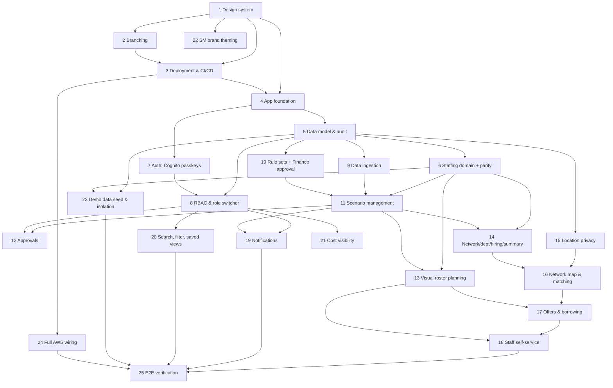

# Implementation Plan — Cashier Staffing Planner

> Derived from `requirements.md` v0.2.0 and `design.md` v0.7.0. Stack per ADR-0002; design system per ADR-0003 (Tailwind + shadcn/ui, token-driven); deployment/CI-CD per ADR-0004 (S3+CloudFront SPA, Lambda+API Gateway, GitHub Flow to a single prod, GitHub Actions + OIDC).
> Order reflects a walking-skeleton approach: design system → branching → deployment pipeline → app foundation → features. Each task lists the requirements it implements; property-based tests (P1–P19) follow the testing strategy (TS-002).

## Overview

Phase 1 establishes the **design system** (style guide tokens + UX-system components) so all later UI is built from branded, accessible primitives. Phase 2 sets up the **git branching strategy and repository automation**. Phase 3 stands up **deployment and CI/CD** so a merge to `main` deploys the app to AWS, with a deployable walking skeleton behind it. Phases 4+ build the data model, the staffing domain, auth/RBAC and the feature areas, then cross-cutting concerns, demo data and end-to-end verification. Property-based tests for the 19 correctness properties (P1–P19) are embedded where each property is owned and re-verified at the end.

## Tasks

- [ ] 1. Design system: style guide and UX system
- [ ] 1.1 Frontend scaffold and design tokens
  - Scaffold the React + TypeScript SPA (Vite) with Tailwind CSS and shadcn/ui per ADR-0003.
  - Define design tokens (colour palette with semantic ramps and accessible on-colours, typography, spacing, radius, elevation, motion durations/easings) as CSS variables and wire them into the Tailwind config; grayscale/neutral until SM brand tokens land (SG-004, Q8).
  - Enforce token usage across the whole frontend: no raw hex, px font sizes or ad-hoc timings in components; add lint rules where possible and check in review.
  - Structure tokens so a future dark mode (SG-009) is a value swap, not a component change.
  - _Requirements: 23, 24 (SG-002, SG-004, SG-005, SG-009, ADR-0003)_
- [ ] 1.2 Theme: colour palette and motion/animation
  - Build the colour theme (brand, neutral, semantic ramps; separate labelled categorical palette for data-viz per SG-010).
  - Build the motion/animation theme (SG-007): named duration and easing tokens, a standard set of transitions (fade, slide, expand, skeleton shimmer) and component animations (dialogs, drawers, toasts, tab changes, timeline drag/resize feedback). All motion honours `prefers-reduced-motion` and drops to no-motion; nothing conveys meaning by motion alone.
  - _Requirements: 24 (SG-007, SG-004, SG-010, NFR-A11Y-001)_
- [ ] 1.3 App brand mark (icon/logo)
  - Design a single simple SVG mark and export it for every context: favicon (16/32/48 + SVG), PWA/app icons (180 maskable, 192, 512), the sign-in hero lockup, the top-bar brand, OG/social preview, and a monochrome print variant.
  - Drive the mark from brand tokens so it is theme-aware and legible at 16 px; use a neutral placeholder until SM brand guidelines arrive (Q8).
  - _Requirements: 24 (SG-003, SG-008, SG-004)_
- [ ] 1.4 Core components and states
  - Build the atomic and composite components the wireframes use: buttons, inputs/selects, tabs, dialogs/drawers, tables (sortable, sticky header/first column), cards, pills/status, KPI cards, toasts, breadcrumbs, side nav and top bar.
  - Implement the standard states per UX-010: loading (skeletons for KPIs, tables and cards; labelled placeholders for charts/timeline/map; deferred spinner only for short waits), empty, error, no-access, stale, unsaved and success. Skeletons match the final layout to avoid shift and respect `prefers-reduced-motion`.
  - Components ship with correct roles, accessible names, loading/skeleton variants and motion by default, so screens don't re-implement them.
  - _Requirements: 21, 24 (SG-001, SG-006, UX-005, UX-010)_
- [ ] 1.5 Error and status pages (SCR-090)
  - Build 400/401/403/404/429/500/503 and offline pages, each with a plain-language message, a reference ID, localisation, and a clear way back to safety (Home / previous safe screen / sign-in). No dead ends; no stack traces or object details leaked; announced to assistive tech.
  - _Requirements: 2, 24 (UX-010)_
- [ ] 1.6 Grid, layout system and responsive breakpoints
  - Implement the responsive grid (12 columns; 8 on tablet; 4 on mobile) with token-driven gutters, outer margins and container widths (laptop 1280 px, desktop 1600 px) per the design's grid table.
  - Build the layout primitives — Page, Grid/Col, Stack, Cluster, Split/Sidebar, Section — from the spacing scale so screens compose them instead of bespoke CSS; provide a compact density variant for tables and the roster timeline while keeping ≥44 px touch targets.
  - Implement the app shell (top bar, side nav, breadcrumb, sample-data banner slot) and the four breakpoints (mobile <600, tablet 600–1023, laptop 1024–1439, desktop ≥1440), including the mobile nav drawer and full-screen search.
  - _Requirements: 24 (UX-002, UX-005, UX-006, UX-007, SG-005)_
- [ ] 1.7 Accessibility and ARIA/labelling standard
  - Establish landmarks, skip link, focus management and the ARIA/labelling standard (UX-004): accessible names on every control, aria-labels on icon-only buttons, documented patterns for tabs/dialogs/menus/grids/timeline, descriptive cell-action labels, and live regions for async results. Add automated accessibility checks to the component gallery.
  - _Requirements: 24 (UX-001, UX-004, NFR-A11Y-001)_
- [ ] 1.8 Internationalisation and microcopy/voice
  - Set up the i18n framework with en/fil resource bundles, the language switcher, and locale-aware date/number/₱ formatting.
  - Add the numeric/currency type token (`--font-num`, tabular figures) and a shared Currency/Num component: render ₱ as the Unicode peso sign (U+20B1) with a font fallback that includes the glyph, right-aligned tabular columns; verify ₱ renders on Windows/macOS/iOS/Android/Linux (SG-002).
  - Establish the microcopy/voice conventions (UX-003) with a canonical string reference for common actions, states and errors; all UI text, labels and errors sourced from bundles (no hardcoding).
  - _Requirements: 23, 24 (UX-003, UX-011, NFR-L10N-001)_
- [ ] 1.9 Keyboard shortcuts and help
  - Implement the global shortcut scheme (`/` or ⌘K search, `?` shortcut reference, `g`+key navigation, `n` notifications, Esc close) and roster-timeline shortcuts (arrow/Enter, keyboard equivalents for drag/resize/bulk); disabled while typing, never focus-trapping, all discoverable.
  - Build the Help and shortcuts screen (SCR-091) and in-context "How it works" help drawn from DOM-001/DOM-003; field-level hints with accessible info popovers (never tooltip-only for essential info).
  - _Requirements: 24 (UX-003, UX-004, SG-000)_
- [ ] 1.10 Component gallery
  - Publish a component gallery/storybook documenting components, tokens, motion and states as the living style-guide reference (SG-000/001, UX-010).
  - _Requirements: 24 (SG-000)_

- [ ] 2. Git branching strategy and repository automation
- [ ] 2.1 Branching model and protection
  - Adopt GitHub Flow (ADR-0004): short-lived branches, PRs into `main`, `main` always deployable. Document it in DEP-001.
  - Configure branch protection on `main`: require PR, require passing status checks, no direct pushes.
  - _Requirements: NFR summary (DEP-001)_
- [ ] 2.2 Repository conventions and PR automation
  - Add PR template, CODEOWNERS, commit/PR title conventions, and the docs-conventions check; wire the spec-format validation into CI where applicable.
  - _Requirements: NFR summary (DEP-001, GOV-000)_

- [ ] 3. Deployment and CI/CD (merge to main → deploy to AWS)
- [ ] 3.1 CDK infrastructure skeleton
  - Create the AWS CDK app (TypeScript) with stacks for SPA hosting (S3 + CloudFront) and the API (Lambda + API Gateway), parameterised for a single `prod` env but structured to add `staging` later (ADR-0004, DEP-003/004/005).
  - _Requirements: NFR summary (DEP-003, DEP-004, DEP-005)_
- [ ] 3.2 GitHub Actions OIDC and AWS role
  - Configure GitHub Actions to assume an AWS IAM role via OIDC (no stored keys); scope the role to the deploy actions.
  - _Requirements: NFR summary (DEP-002, NFR-SEC-004)_
- [ ] 3.3 PR pipeline
  - On pull requests: install, build, lint, run tests, and run `cdk synth` + `cdk diff`; block merge on failure.
  - _Requirements: NFR summary (DEP-002)_
- [ ] 3.4 Deploy pipeline on merge to main
  - On merge to `main`: build the SPA and API, then `cdk deploy` to AWS prod (upload SPA to S3, invalidate CloudFront, deploy Lambda/API Gateway). Keep a promotion gate/staging stage easy to add later.
  - _Requirements: NFR summary (DEP-002, DEP-003)_
- [ ] 3.5 Walking-skeleton deploy
  - Deploy a minimal SPA (the app shell from task 1.3) served by CloudFront calling a health-check API endpoint, to prove the full pipeline end to end before feature work.
  - _Requirements: NFR summary (DEP-002, DEP-003)_

- [ ] 4. Application foundation (API + shared types)
  - Scaffold the Node + TypeScript API service and a shared types package; add the test runner with property-based testing support; connect the API skeleton to the CI/CD pipeline from phase 3.
  - _Requirements: NFR summary (ADR-0002)_

- [ ] 5. Data model and persistence
- [ ] 5.1 Relational schema and migrations
  - Implement tables for User, Passkey, RoleAssignment, Store, Department, Dataset/Snapshot, IngestionRun, RuleSet/RuleVersion, Scenario, ScenarioRun, ApprovalStep, Staff/Availability, ShiftOverride, StaffRequest, StoreLocation, StaffHomeArea, TravelTime, ShiftOffer, TransferRequest, Notification, NotificationPreference, SavedView, AuditEvent, per DOM-002. Include the `synthetic` flag and User `language`.
  - _Requirements: 4, 8, 17, 19_
- [ ] 5.2 Append-only audit log
  - Implement the immutable AuditEvent store (time, user, active role, event, object, before/after).
  - Property test: every create/edit/submit/decision/publish/ingestion/export/role-change writes exactly one event (P7).
  - _Requirements: 22 (P7)_

- [ ] 6. Core staffing domain (pure TypeScript, prototype parity)
- [ ] 6.1 Forecast, Erlang C and shrinkage
  - Implement hourly forecast, Erlang C lane sizing to the service target, and shrinkage uplift per DOM-001.
  - _Requirements: 4_
- [ ] 6.2 Shift builder, roster assignment and labor rules
  - Implement shift construction, named roster assignment and PH labor-rule checks (consecutive days, weekly hours, rest ≥ 10 h, mandatory 24-hour rest after 6 days).
  - _Requirements: 4, 6.7, 7.4_
- [ ] 6.3 Hiring plan and cost model
  - Implement seasonal team sizing, hiring waves by lead time, and the cost model from wage/premium rule versions.
  - _Requirements: 4, 10_
- [ ] 6.4 Parity test suite against DOM-001 tolerance
  - Golden-master/property test running the pipeline on the seeded demo snapshot, asserting parity with v3 per the DOM-001 tolerance table and fixtures A–C (integers exact; cost ±0.5%; roster on shift-set and hours). Fixture A: Erlang example (λ=240, h=2.5 → 13 cashiers @ 90%/60s). Fixture C: QC main lanes Dec 19 (19 peak) and network Dec 19 (254 peak, 555 rostered, 3,688 hours). Assert single-department vs all-stores consistency.
  - _Requirements: 4 (P2, P6)_

- [ ] 7. Authentication (Cognito passkeys) and domain allowlist
- [ ] 7.1 Cognito user pool with passkey sign-in
  - Configure passkey (WebAuthn) sign-in with no password path; first sign-in / new-device email one-time code leading to passkey registration; passkey management (list/add/remove, block last-passkey removal).
  - _Requirements: 1.3, 1.4, 1.5, 1.6, 1.9_
- [ ] 7.2 Domain allowlist and self sign-up
  - Pre-sign-up Lambda enforcing smretail.com / 1cloudhub.com; self sign-up in demo mode; reject other domains with the specified message.
  - Property test: no account exists with a domain outside the allowlist (P13).
  - _Requirements: 1.1, 1.2, 1.7 (P13)_
- [ ] 7.3 Session timeout
  - 60-minute idle timeout with a 2-minute warning and return-to-URL after re-auth.
  - _Requirements: 1.8_

- [ ] 8. Authorization, roles and demo role switcher
- [ ] 8.1 RBAC and scope enforcement (server-side)
  - Implement the RBAC matrix and scope model (global/region/store/self); enforce on every request; hide inaccessible nav; "No access" state for out-of-scope deep links without leaking attributes.
  - Property tests: every shown store is in scope (P1); every request authorised against the active role, audit records user+role (P12).
  - _Requirements: 2 (P1, P12)_
- [ ] 8.2 Demo role switcher
  - Implement the "Viewing as" switcher across all 8 roles (config-flagged), applying the active role's permissions/scope per request and keeping page or routing Home.
  - _Requirements: 3 (P12)_

- [ ] 9. Data ingestion and provenance
- [ ] 9.1 File upload and validation
  - Upload POS/master/staff data to S3; validate with per-row warnings/errors and a downloadable report; block loads with errors and keep the prior dataset; record ingestion history.
  - _Requirements: 17.1, 17.2, 17.3, 17.5_
- [ ] 9.2 Snapshots, staleness signalling and synthetic flag
  - Pin datasets as snapshots; on load compute and notify affected stale scenarios; synthetic flag with Rules-Steward-only clearing.
  - _Requirements: 17.4, 17.6, 8.4_
- [ ] 9.3 Sample-data provenance
  - Non-dismissible banner while any in-use dataset is synthetic; sample-data marker on every export and the printed summary.
  - Property test: banner on every page and marker on every export while synthetic (P9).
  - _Requirements: 18 (P9)_

- [ ] 10. Business rule sets with Finance approval
- [ ] 10.1 Versioned rule sets
  - Effective-dated rule versions (holidays, wages, premiums, lead times); scenarios record the version used; publishing never changes existing results.
  - Property test: results carry rules version + snapshot; republish doesn't alter prior results (P6).
  - _Requirements: 16.1, 16.2 (P6)_
- [ ] 10.2 Cost-rule approval flow
  - Require Finance approval before publishing a cost rule; Rules Steward publishes non-cost rules directly; flag affected scenarios stale and notify owners, Finance and HR; audit each transition.
  - _Requirements: 16.3, 16.4, 16.5, 16.6 (P7)_

- [ ] 11. Scenario management
- [ ] 11.1 Scenario CRUD, lifecycle and single-published invariant
  - Create/duplicate/edit-settings/archive; one Published per season marked ★; Submitted/Published settings read-only ("Duplicate as draft").
  - Property tests: at most one Published per season (P3); Submitted/Published settings never mutate (P4).
  - _Requirements: 8.1, 8.2, 8.3 (P3, P4)_
- [ ] 11.2 Staleness engine
  - Flag stale exactly when snapshot/rules superseded or settings changed after last run; block submission of stale; pause submitted scenarios that become stale and notify approvers.
  - Property test: stale flag correctness and submission block (P5).
  - _Requirements: 8.4, 8.5 (P5)_
- [ ] 11.3 Scenario compare
  - Side-by-side compare of inputs and results.
  - _Requirements: 8.6_

- [ ] 12. Approval workflow (headcount, budget, plan)
  - Create the three approval steps on submit; headcount/budget in either order; only the Executive records either as secured outside the system (reference + note, visible to HR/Finance); Plan approval disabled until both secured; publish and supersede on Executive approval; reset steps on request-changes/reject (comment required).
  - Property test: a plan publishes only when headcount and budget are both approved or recorded outside (P10); one audit event per transition (P7).
  - _Requirements: 9 (P10, P7)_

- [ ] 13. Visual roster planning
- [ ] 13.1 Day timeline
  - Per-cashier timeline with shift bars, activity segments, staffing-versus-need strip, drag-to-move/resize (15-min snap), multi-select bulk actions, keyboard-accessible shift editor.
  - _Requirements: 6.1, 6.2, 6.6_
- [ ] 13.2 Week grid, Month coverage and zoom
  - Week/Fortnight/Four-weeks grid (chips, totals panel, filters), Month coverage, date navigator and zoom; labels always paired with colour.
  - _Requirements: 6.1, 6.3, 6.4, 6.7_
- [ ] 13.3 Mobile roster views
  - Day as a list per cashier, Week as a list per day on phones, editable only for emergency off/reassign.
  - _Requirements: 6.5, 24.2_
- [ ] 13.4 Store-manager overrides
  - Emergency off, reassign, time change, add/remove on a published roster as ShiftOverrides; mark ✎; notify affected cashiers; require a reason on rule breach; hard-block the 24-hour-rest breach.
  - Property test: every published-roster change produces a ShiftOverride + audit event, breaches carry a reason, the 24-hour-rest breach is never saved (P14).
  - _Requirements: 7 (P14)_

- [ ] 14. Network view, department plan, hiring plan and summary
- [ ] 14.1 Network view and department day plan
  - All-stores/departments view and the drill-down hourly department plan with shift builder; CSV export respecting filters and scope; chart table-alternatives.
  - _Requirements: 5 (P1)_
- [ ] 14.2 Background jobs for hiring plan and long rosters
  - Run hiring plans and >4-week rosters as queued, resumable, idempotent jobs with progress and completion notifications; cache results per scenario version.
  - _Requirements: 10.1, 10.2, 10.4 (NFR-REL-001/002)_
- [ ] 14.3 Leadership summary export
  - Generate the one-page summary from a scenario and export to PDF/print (A4) with provenance.
  - _Requirements: 10.3, 18.3_

- [ ] 15. Location privacy and home-area consent
  - StaffHomeArea at barangay granularity only (no address/GPS); opt-in consent and immediate withdrawal; no screen/export/API exposes finer than barangay; cross-store candidates as ID/home store/barangay until an offer is accepted.
  - Property test: no location finer than barangay is exposed; non-consented/withdrawn staff never appear in map or matching (P15).
  - _Requirements: 12 (P15)_

- [ ] 16. Network map and cross-store matching
- [ ] 16.1 Map, layers and travel-time rings (Amazon Location Service)
  - Metro Manila stores as gap/surplus/balanced pins with staff layers; re-centre 15/30/45-minute rings on the selected store; filter by store format; equivalent data table.
  - _Requirements: 11.1, 11.2, 11.6, 11.8 (P1)_
- [ ] 16.2 Travel-time matrix
  - Compute/cache a home-area-to-store matrix via Amazon Location Service (car) with the public-transport speed-factor estimate; precompute per time window.
  - _Requirements: 11.2, 11.3_
- [ ] 16.3 Candidate ranking and eligibility
  - Rank by travel time → labor-rule headroom (hours across all stores) → fairness → cost; include only eligible candidates.
  - Property test: every offered cashier is trained, available and within all labor rules counting cross-store hours (P16).
  - _Requirements: 11.3, 11.4, 11.5 (P16)_
- [ ] 16.4 Auto-match all gaps
  - Propose network-wide offers and store-to-store moves minimising total travel; present for review before sending.
  - _Requirements: 11.7_

- [ ] 17. Shift offers and store-to-store borrowing
- [ ] 17.1 Offers with single-acceptance
  - Broadcast offers to selected eligible cashiers (store, time, travel, pay, allowance, expiry); 30-minute expiry; first acceptance wins; move all other offers for the shift to expired/withdrawn; notify sender; transport allowance by travel band.
  - Property test: at most one accepted offer per shift; others expire/withdraw at that moment (P17).
  - _Requirements: 13 (P17, P16)_
- [ ] 17.2 Store-to-store borrowing
  - Borrow requests with lending-manager approval (planner override with reason); show borrowed cashiers in the receiving roster with home store and travel time; count hours to their own limits.
  - _Requirements: 14 (P14, P16)_

- [ ] 18. Staff self-service
- [ ] 18.1 My roster and offers
  - Show only the cashier's own shifts, changes and rest days (no other names/costs); accept/decline offers within travel limit; add to calendar.
  - Property test: a Staff user never sees another cashier's name, shift or cost (P11).
  - _Requirements: 15.1, 15.2 (P11)_
- [ ] 18.2 Time-off and swap requests
  - Time-off and swap requests routed to the store manager; roster unchanged while pending; approval applies unavailability or a ShiftOverride and notifies both cashiers; rule-breach reason/hard-block rules apply; audit requests and decisions; manager Requests panel on the roster.
  - Property test: roster unchanged while pending; only approval applies the change; all audited (P19).
  - _Requirements: 15.3, 15.4, 15.5, 15.6, 15.7, 7.3, 7.4 (P19)_

- [ ] 19. Notifications
  - In-app notifications for all listed events with the bell (unread count, deep links); email immediately per event via SES (no digest); per-event email opt-out except approvals/critical; scope-filtered recipients; language-aware emails/push.
  - _Requirements: 20 (P1)_

- [ ] 20. Search, filter and saved views
  - Global search (/ or ⌘K) grouped and scope-filtered; the planning context bar with cascading filters; URL-encoded filters/sort/scenario; saved views with a per-screen default.
  - Property test: loading a shared URL reproduces the same filters/sort/scenario within the loader's scope (P8).
  - _Requirements: 21 (P1, P8)_

- [ ] 21. Cost visibility
  - Show ₱ figures to EXE/PLN/HR/FIN in scope and to Store Managers for their own store only; never to Staff.
  - _Requirements: 25 (P1, P11)_

- [ ] 22. SM brand theming
  - Apply SM brand tokens (SG-004, Q8) to the design system once received: colour, typography and logo; re-verify contrast and accessibility. Blocked until brand guidelines are available; grayscale until then.
  - _Requirements: 24 (SG-004, NFR-A11Y-001)_

- [ ] 23. Demo data seed and isolation
  - Deterministic seeder for the 27 stores, staff with consented home areas, synthetic POS history (v3 profiles), scenarios in each lifecycle state, roster activity, notifications and audit; label all "Demo data".
  - Staff persona picker in demo mode; audited Administrator reset that never touches real data.
  - Property test: any snapshot/run/export is entirely synthetic or entirely real; reset never changes real records (P18).
  - _Requirements: 19 (P18)_

- [ ] 24. Full AWS wiring for feature services
  - Extend the CDK stacks (from phase 3) with PostgreSQL/Aurora, S3 buckets, SQS + workers, Cognito, SES and Amazon Location Service; wire environment config and secrets via the OIDC pipeline.
  - _Requirements: NFR summary (DEP-003, DEP-004)_

- [ ] 25. End-to-end verification against journeys and properties
  - Walk journeys J1–J11 through the deployed app for a representative of each role; confirm all 19 property-based test suites pass; run the DOM-001 parity suite; verify NFR performance targets on the demo network.
  - _Requirements: all (P1–P19)_

## Task Dependency Graph



```json
{
  "waves": [
    { "wave": 1, "tasks": ["1"] },
    { "wave": 2, "tasks": ["2"] },
    { "wave": 3, "tasks": ["3"] },
    { "wave": 4, "tasks": ["4", "22"] },
    { "wave": 5, "tasks": ["5", "7"] },
    { "wave": 6, "tasks": ["6", "8", "9", "10", "15", "24"] },
    { "wave": 7, "tasks": ["11", "20", "21", "23"] },
    { "wave": 8, "tasks": ["12", "13", "14", "19"] },
    { "wave": 9, "tasks": ["16"] },
    { "wave": 10, "tasks": ["17"] },
    { "wave": 11, "tasks": ["18"] },
    { "wave": 12, "tasks": ["25"] }
  ],
  "dependencies": {
    "2": ["1"], "3": ["1", "2"], "4": ["1", "3"],
    "5": ["4"], "6": ["5"], "7": ["4"], "8": ["5", "7"],
    "9": ["5"], "10": ["5"], "11": ["6", "9", "10"], "12": ["11", "8"],
    "13": ["6", "11"], "14": ["6", "11"], "15": ["5"], "16": ["15", "14"],
    "17": ["16", "13"], "18": ["17", "13"], "19": ["8", "11"], "20": ["8"],
    "21": ["8"], "22": ["1"], "23": ["5", "6"], "24": ["3"],
    "25": ["18", "19", "20", "23", "24"]
  }
}
```

## Notes

- **Order rationale:** the design system (1), branching (2) and deployment/CI-CD (3) come first so every later screen is built from branded, accessible, token-driven components and ships through an automated pipeline. Task 3.5 deploys a walking skeleton to prove "merge to `main` → deploy to AWS" before feature work.
- **Design-system enforcements (task 1):** tokens everywhere (1.1), colour + motion/animation theme (1.2), app brand mark/favicon (1.3), components with loading/skeleton states (1.4), a token-driven grid + layout primitives (1.6), 4xx/5xx + offline error pages with a way back (1.5), ARIA/labelling standard (1.7), microcopy/voice (1.8), keyboard shortcuts + help (1.9), all documented in the component gallery (1.10).
- **Deployment model:** GitHub Flow to a single `prod` (ADR-0004); the pipeline is written so a `staging` env and manual promotion gate can be added later.
- **Testing:** property-based tests (P1–P19) live with the feature that owns each property and are re-run in task 25. Parity (6.4) uses the DOM-001 tolerance and the deterministic demo seed (23).
- **Blocked:** SM brand theming (22) waits on SM brand guidelines (SG-004, Q8); the mark and tokens stay neutral until then. The v3 prototype HTML files must be added to `docs/references/prototype-v3/` for the parity suite.
- **Verification bar:** journeys J1–J11 and the NFR targets (NFR-001) are checked in task 25 against the deployed demo network.
